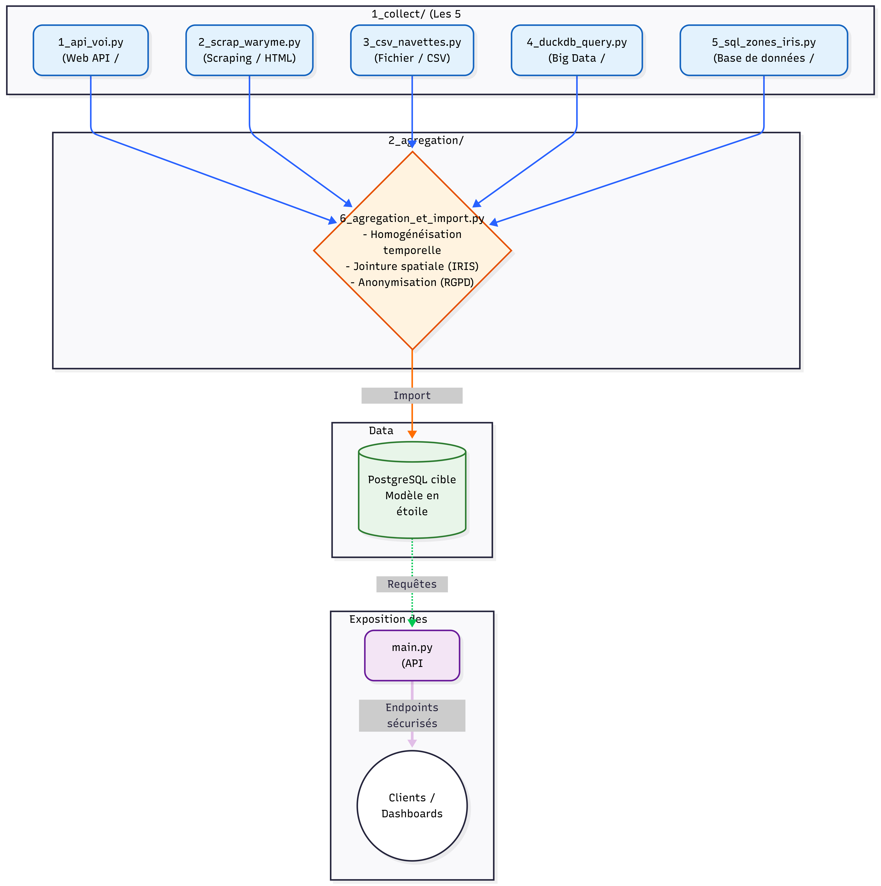

# Evaluation - E 1

## Collecte, stockage et mise à disposition des données d’un projet en intelligence artificielle
Bloc de compétences 1.
référence : REAC page 1.
Rapport de 2 à 5 pages.

---

## Sommaire

- [C1. Automatiser l’extraction de données](#c1-automatiser-lextraction-de-données)
depuis :
    - un service web
    - une page web (scraping*)
    - un fichier de données
    - une base de données
    - un système big data
*en programmant le script* adapté afin de pérenniser la collecte des données nécessaires au projet.

- [C2. Développer des requêtes de type SQL d’extraction des données](#c2-développer-des-requêtes-de-type-sql-dextraction-des-données)
depuis :
    - un système de gestion de base de données
    - et un système big data
en appliquant le langage de requête propre au système afin de préparer la collecte des données nécessaires au projet.

- [C3. Développer des règles d'agrégation de données](#c3-développer-des-règles-dagrégation-de-données)
issues de différentes sources en programmant, sous forme de script, la suppression des entrées corrompues et en programmant l’homogénéisation des formats des données afin de préparer le stockage du jeu de données final.

- [C4. Créer une base de données dans le respect du RGPD](#c4-créer-une-base-de-données-dans-le-respect-du-rgpd)
en élaborant les modèles conceptuels et physiques des données à partir des données préparées et en programmant leur import afin de stocker le jeu de données du projet.

- [C5. Développer une API mettant à disposition le jeu de données](#c5-développer-une-api-mettant-à-disposition-le-jeu-de-données)
en utilisant l’architecture REST afin de permettre l’exploitation du jeu de données par les autres composants du projet.

---
---
---

### Projet : L'Observatoire Global de la Mobilité et de la Sécurité à Marseille

Pour ce bloc de compétences, j'ai conçu un pipeline de données visant à alimenter un "Observatoire de la Mobilité". Ce projet agrège des données hétérogènes issues de différents acteurs de la mobilité marseillaise : les trottinettes en libre-service (VOI), les transports en commun terrestres (RTM / Alertes de sécurité Waryme) et la mobilité maritime (Navettes maritimes). L'objectif est de consolider ces flux dans un entrepôt de données unifié (modèle en étoile), afin de permettre des analyses croisées par zone géographique (IRIS).

---

## C1. Automatiser l’extraction de données
Afin de construire cet entrepôt, j'ai programmé des scripts d'extraction automatisés ciblant 5 types de sources de natures différentes, toutes reliées au thème de la mobilité à Marseille.

**Tableau récapitulatif des 5 sources de données :**

| Type de Source (C1) | Provenance & Description | Format | Technologie / Librairie | Volume / Fréquence |
| :--- | :--- | :--- | :--- | :--- |
| **1. Web API** | **API VOI (MDS Provider)** : État des flottes de trottinettes, trajets et géolocalisation. | JSON | Python (`requests`) | Milliers d'événements / incrémental mensuel. |
| **2. Web Scraping** | **Interface Waryme (RTM)** : Alertes de sécurité sur le réseau. | HTML | Python (`Playwright`) | Scraping hebdomadaire. |
| **3. Fichier** | **Navettes Maritimes (RTM)** : Registre historique d'exploitation métier (`maritime_clean.csv`). | CSV | Python (`pandas`) | Fichier statique historique. |
| **4. Système Big Data** | **Historique VOI & RTM** : Snapshots et historiques massifs de trajets convertis pour PowerBI. | `.parquet` | Python (`DuckDB` / `pandas`) | Gigaoctets de données historiques. |
| **5. Base de Données** | **Référentiel IRIS (Marseille)** : Découpage géographique officiel de la ville utilisé pour les jointures spatiales. | SQL | PostgreSQL (`sqlalchemy`) | Statique (référentiel des zones). |

**Justification des choix techniques :**
*   **Scraping avec Playwright :** L'extraction des alertes Waryme ne pouvait pas se faire via une API standard en raison d'un pare-feu et de l'absence d'API directe. J'ai donc automatisé un navigateur complet via `Playwright` pour contourner ces contraintes réseau d'entreprise et récupérer le code HTML.
*   **Format Big Data (Parquet) :** Les données de trajets VOI générant un très fort volume, leur format brut JSON entraînait des goulots d'étranglement. L'utilisation du format `.parquet` compressé en colonnes permet d'ingérer et de requêter ces volumes massifs de manière très performante.

<!-- { width=90% } -->

---

## C2. Développer des requêtes de type SQL d’extraction des données
L'extraction depuis nos bases de données relationnelles et nos systèmes Big Data s'appuie sur des requêtes SQL optimisées.

###  Requêtage du système Big Data (DuckDB sur fichiers Parquet)
Plutôt que de charger les lourds historiques de trajets en RAM, j'utilise `DuckDB` pour exécuter des requêtes SQL analytiques directement sur le dossier contenant les fichiers `.parquet`.

#### Optimisation technique
Au lieu d'utiliser un `SELECT *`, la requête sélectionne uniquement les colonnes temporelles et géographiques nécessaires, et filtre en amont sur la zone de Marseille (clause `WHERE zone = 'zone_1'`).

Le format colonnaire de Parquet empêche la lecture inutile des autres champs sur le disque (réduction drastique des coûts d'I/O).

Pour les historiques massifs, je n'ai pas utilisé un simple `pandas.read_parquet()`mais `DuckDB` pour exécuter du `SQL` directement sur les fichiers. 
Cela permet un **Predicate Pushdown** : la clause `SELECT` et le filtrage `WHERE` sont appliqués directement sur le disque grâce au format colonnaire `Parquet`. 
Je ne charge dans ma RAM que les 4 colonnes dont j'ai besoin, et non l'intégralité des gigaoctets de données de chaque trajet VOI

###  Requêtage de la base de données relationnelle (PostgreSQL)
La récupération du référentiel géographique s'effectue via `SQLAlchemy`.
*Optimisation technique :* Une requête `SELECT code_iris, nom_iris, geometrie FROM zones_iris` extrait ce référentiel métier pour permettre ensuite une jointure avec nos autres sources.

`SQLAlchemy` : C'est la norme dans l'industrie Python pour interagir avec des bases relationnelles.

Ne fait pas `SELECT *`, mais cible uniquement les colonnes utiles (code_iris, nom_iris, geometrie) et filtre par la clause `WHERE ville = 'Marseille'`

---

## C3. Développer des règles d'agrégation de données
Pour créer un jeu de données final exploitable, j'ai développé des scripts Python (utilisant massivement `pandas`) afin de nettoyer et fusionner ces sources hétérogènes.

**Règles de nettoyage et d'homogénéisation :**
1.  **Suppression des entrées corrompues :** Traitement des valeurs nulles (NaN) et exclusion des trajets aberrants (ex: trajets de durée nulle ou géolocalisations hors frontières).
2.  **Homogénéisation temporelle :** Conversion de tous les formats de date (timestamps UNIX de l'API VOI, chaînes de caractères du CSV des Navettes) vers un format standardisé ISO 8601 (`datetime64`).
3.  **Agrégation spatiale (La clé de jointure) :** C'est le cœur du processus. Les trajets VOI, les alertes sécuritaires Waryme et les données d'exploitation des navettes ont été fusionnées en utilisant une clé commune : le **code IRIS** de la zone géographique concernée. Un script applique une jointure spatiale pour que chaque événement soit rattaché à son quartier marseillais (ex: `zone_iris_start_code`, `zone_iris_end_code`).

**Fichier 6_agregation_et_import.py**
`pd.to_datetime()` et `dropna()`.
Je ne pas stocke pas simplement les données, je les harmonise.
`pd.merge` rassemble les différentes sources grâce au code_iris (la clé de voûte de l'"Observatoire")

---

## C4. Créer une base de données dans le respect du RGPD
Une fois les données de mobilité agrégées et nettoyées, elles sont importées dans une base de données cible structurée pour l'analyse et la restitution.

### Choix du SGBD et Modélisation

J'ai opté pour `PostgreSQL`comme base de données cible pour la production. 
C'est un `SGBD` relationnel robuste, parfaitement adapté pour traiter les jointures spatiales (via l'extension `PostGIS` si besoin) et garantir l'intégrité référentielle des données. 

Cependant, afin de faciliter la démonstration hors-ligne. Le code local tourne actuellement sur un "mock" ``SQLite`` (``mobilite_db.sqlite``) généré par le script ``create_mock_db.py``
#### La conception a suivi la [Méthode Merise](https://www.manageengine.com/fr/blog/general/methode-merise-comprendre-les-differents-modeles-de-donnees.html)

##### MCD (Modèle Conceptuel des Données)
Identification des entités principales (Trajet, Alerte_Securite, Zone_Iris, Vehicule) et de leurs cardinalités (ex: Une zone IRIS peut contenir 0 à N alertes).

##### MPD (Modèle Physique des Données)
Traduction en un modèle en étoile (optimisé pour des outils comme Power BI)

##### Tables de faits
- Fact_Trips (ID, start_time, end_time, zone_iris_code)
- Fact_Alerts (ID, timestamp, type_incident, zone_iris_code)

##### Tables de dimensions
- DimIris (code_iris, nom, geometrie)
- DimVehicle (vehicle_id, type).
###  Import et script SQL
Le script d'import, développé en `Python` avec l'ORM (Object-Relational Mapping) [SQLAlchemy](annexes/ORM_SqlAlchemy.md) :
- se connecte à ``PostgreSQL``
- génère automatiquement le schéma physique via l'ORM
- insère les DataFrames ``Pandas`` sous forme de lots (batch inserts) pour optimiser les performances.
###  Conformité RGPD (Privacy by Design)
Le respect du RGPD a été un enjeu majeur, particulièrement pour la source de données issue du scraping de l'interface Waryme (RTM). 
Ces alertes de sécurité contenaient des Données à Caractère Personnel sensibles concernant les émetteurs (nom, prénom).

**Traitement :**

Dans le script de nettoyage `process_data.py`, j'ai programmé une règle stricte d'anonymisation
. Les colonnes contenant les DCP sont définitivement supprimées (dropped) du DataFrame en mémoire avant tout import SQL.

**Résultat :**

La table finale ``Fact_Alerts`` ne contient que des données statistiques de sécurité (type d'incident, date, code IRIS). La base de données est ainsi totalement exempte de données personnelles, annulant les risques de fuite de données et simplifiant le registre des traitements

**Fichier `6_agregation_et_import.py`**
Fonction `clean_and_anonymize_waryme`:
pour respecter le **RGPD** en suivant le principe de **Privacy By Design**, je m'assure de faire un `df.drop(columns=['nom_emetteur'])` en RAM, avant même que la fonction `to_sql()` ne touche la base de données.
Ainsi, ma base PostgreSQL finale ne contient strictement aucune donnée personnelle

---

## C5. Développer une API mettant à disposition le jeu de données

Afin de permettre l'exploitation de l'Observatoire de la Mobilité par les autres composants du système d'information (applications tierces, tableaux de bord de data visualisation), j'ai développé une [API sécurisée](https://github.com/bruno-coulet/mobilites/blob/main/main.py) s'appuyant sur le framework [FastAPI](https://fastapi.tiangolo.com/fr/).

### Architecture REST et Endpoints

L'API respecte strictement les principes de l'architecture REST, avec des points de terminaison (endpoints) clairs permettant de requêter le modèle en étoile :

- `GET /api/v1/mobility/trips` 
    Retourne la liste paginée des trajets (paramètres optionnels : ?start_date=...&end_date=...)
- `GET /api/v1/mobility/alerts/{code_iris}` 
    Retourne les statistiques d'incidents Waryme spécifiques à un quartier marseillais
- `GET /api/v1/mobility/vehicles/active` 
    Expose la dimension des flottes en temps réel.

### Documentation OpenAPI (Swagger)
``FastAPI`` génére nativement le schéma standardisé ``OpenAPI``.  l'API dispose d'une interface de documentation interactive (Swagger UI) accessible sur la route ``/docs``. 
Cela permet de tester les routes et de comprendre la structure des objets JSON retournés (modèles ``Pydantic``) sans nécessiter de documentation externe.

### Sécurisation et standards OWASP
L'accès aux données consolidées de la collectivité ne doit pas être public. 
Suivant les recommandations du standard de sécurité [OWASP *(faille Broken Authentication)*](https://owasp.org/API-Security/editions/2023/en/0xa2-broken-authentication/), j'ai protégé l'intégralité des routes REST : 
- Authentification 
Un middleware exige la présence d'un en-tête ``HTTP X-API-Key`` pour chaque requête
.
- Validation 
Si la clé est absente ou invalide, l'API intercepte la requête et retourne immédiatement un code statut 401 Unauthorized.

L'accès aux données est ainsi strictement limité aux services et utilisateurs autorisés.

---
