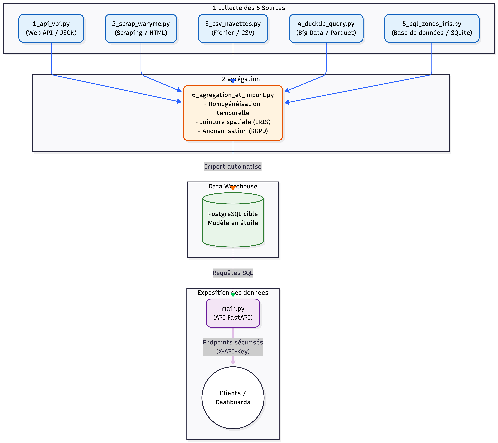

# Evaluation - E 1

## Collecte, stockage et mise à disposition des données d’un projet en intelligence artificielle
Bloc de compétences 1.
référence : REAC page 1.
Rapport de 2 à 5 pages.

---

## Sommaire

- [C1. Automatiser l’extraction de données](#c1-automatiser-lextraction-de-données)
depuis :
    - un service web
    - une page web (scraping*)
    - un fichier de données
    - une base de données
    - un système big data
*en programmant le script* adapté afin de pérenniser la collecte des données nécessaires au projet.

- [C2. Développer des requêtes de type SQL d’extraction des données](#c2-développer-des-requêtes-de-type-sql-dextraction-des-données)
depuis :
    - un système de gestion de base de données
    - et un système big data
en appliquant le langage de requête propre au système afin de préparer la collecte des données nécessaires au projet.

- [C3. Développer des règles d'agrégation de données](#c3-développer-des-règles-dagrégation-de-données)
issues de différentes sources en programmant, sous forme de script, la suppression des entrées corrompues et en programmant l’homogénéisation des formats des données afin de préparer le stockage du jeu de données final.

- [C4. Créer une base de données dans le respect du RGPD](#c4-créer-une-base-de-données-dans-le-respect-du-rgpd)
en élaborant les modèles conceptuels et physiques des données à partir des données préparées et en programmant leur import afin de stocker le jeu de données du projet.

- [C5. Développer une API mettant à disposition le jeu de données](#c5-développer-une-api-mettant-à-disposition-le-jeu-de-données)
en utilisant l’architecture REST afin de permettre l’exploitation du jeu de données par les autres composants du projet.

## Projet : L'Observatoire Global de la Mobilité et de la Sécurité à Marseille

Pour ce bloc de compétences, j'ai conçu un pipeline de données visant à alimenter un "Observatoire de la Mobilité". Ce projet agrège des données hétérogènes issues de différents acteurs de la mobilité marseillaise : les trottinettes en libre-service (VOI), les transports en commun terrestres (RTM / Alertes de sécurité Waryme) et la mobilité maritime (Navettes maritimes). L'objectif est de consolider ces flux dans un entrepôt de données unifié (modèle en étoile), afin de permettre des analyses croisées par zone géographique (IRIS).

---

## C1. Automatiser l’extraction de données
Afin de construire cet entrepôt, j'ai programmé des scripts d'extraction automatisés ciblant 5 types de sources de natures différentes, toutes reliées au thème de la mobilité à Marseille.

**Tableau récapitulatif des 5 sources de données :**

| Type de Source (C1) | Provenance & Description | Format | Technologie / Librairie | Volume / Fréquence |
| :--- | :--- | :--- | :--- | :--- |
| **1. Web API** | **API VOI (MDS Provider)** : État des flottes de trottinettes, trajets et géolocalisation. | JSON | Python (`requests`) | Milliers d'événements / incrémental mensuel. |
| **2. Web Scraping** | **Interface Waryme (RTM)** : Alertes de sécurité sur le réseau. | HTML | Python (`Playwright`) | Scraping hebdomadaire. |
| **3. Fichier** | **Navettes Maritimes (RTM)** : Registre historique d'exploitation métier (`maritime_clean.csv`). | CSV | Python (`pandas`) | Fichier statique historique. |
| **4. Système Big Data** | **Historique VOI & RTM** : Snapshots et historiques massifs de trajets convertis pour PowerBI. | `.parquet` | Python (`DuckDB` / `pandas`) | Gigaoctets de données historiques. |
| **5. Base de Données** | **Référentiel IRIS (Marseille)** : Découpage géographique officiel de la ville utilisé pour les jointures spatiales. | SQL | PostgreSQL (`sqlalchemy`) | Statique (référentiel des zones). |

---

## C2. Développer des requêtes de type SQL d’extraction des données
L'extraction depuis nos bases de données relationnelles et nos systèmes Big Data s'appuie sur des requêtes SQL optimisées.

###  Requêtage du système Big Data (DuckDB sur fichiers Parquet)
Pour les historiques massifs, je n'utilise pas un simple `pandas.read_parquet()`, mais `DuckDB` pour exécuter du `SQL` analytique directement sur le dossier contenant les fichiers `.parquet`.

#### Optimisation (Predicate Pushdown)
La clause `SELECT` et le filtrage `WHERE` sont appliqués directement sur le disque grâce au format colonnaire Parquet.

#### Performance (I/O & RAM)
Je ne charge dans ma RAM que les 4 colonnes dont j'ai besoin, et non l'intégralité des gigaoctets de données de chaque trajet VOI.

### Requêtage de la base de données relationnelle (PostgreSQL)

#### SQLAlchemy
Utilisation de l'ORM standard dans l'industrie Python pour interagir avec le référentiel géographique.
#### Optimisation
Exécution d'une requête SELECT code_iris, nom_iris, geometrie... ciblée, sans utiliser de SELECT *, afin de ne récupérer que les champs strictement nécessaires.

---

## C3. Développer des règles d'agrégation de données
Pour créer un jeu de données final exploitable, j'ai développé des scripts Python (utilisant massivement `pandas`) afin de nettoyer et fusionner ces sources hétérogènes.

**Fichier central :** `6_agregation_et_import.py` Je ne stocke pas simplement les données brutes, je les harmonise :
### Suppression des entrées corrompues (`dropna()`)
Traitement des valeurs nulles (NaN) et exclusion des trajets aberrants (ex: trajets de durée nulle ou géolocalisations hors frontières).
### Homogénéisation temporelle (`pd.to_datetime()`)
Conversion de tous les formats de date (timestamps UNIX de l'API VOI, chaînes de caractères du CSV des Navettes) vers un format standardisé ISO 8601 (`datetime64`).
### Agrégation spatiale (`pd.merge`)
C'est le cœur du processus. Les trajets VOI, les alertes sécuritaires Waryme et les données d'exploitation des navettes ont été fusionnés en utilisant la clé de voûte de l'Observatoire : le code IRIS. Une jointure spatiale rattache chaque événement à son quartier marseillais (ex: `zone_iris_start_code`, `zone_iris_end_code`).

---

## C4. Créer une base de données dans le respect du RGPD
Une fois les données de mobilité agrégées et nettoyées, elles sont importées dans une base de données cible structurée pour l'analyse et la restitution.

### Choix du SGBD et Modélisation
*   **SGBD de Production :** Choix de `PostgreSQL`, système relationnel robuste, parfaitement adapté pour traiter les jointures spatiales et garantir l'intégrité référentielle.
*   **Environnement local :** Pour faciliter la démonstration hors-ligne, le code tourne sur un "mock" `SQLite` (`mobilite_db.sqlite`) généré par le script `create_mock_db.py`.

#### Conception selon la méthode Merise
*   **MCD (Modèle Conceptuel des Données) :** Identification des entités principales (Trajet, Alerte_Securite, Zone_Iris, Vehicule) et de leurs cardinalités (ex: une zone IRIS peut contenir 0 à N alertes).
*   **MPD (Modèle Physique des Données) :** Traduction en un modèle en étoile optimisé pour les outils analytiques (`Power BI`) :
    *   *Tables de faits :* `Fact_Trips`, `Fact_Alerts`.
    *   *Tables de dimensions :* `DimIris`, `DimVehicle`.

### Script d'import SQL
L'importation est automatisée via un script Python s'appuyant sur l'ORM `SQLAlchemy` :
*   **Génération du schéma :** Connexion à la base et création automatique du schéma physique via l'ORM.
*   **Performance :** Insertion des DataFrames `Pandas` sous forme de lots (*batch inserts*) pour optimiser le temps d'écriture en base.

### Conformité RGPD (Privacy by Design)
Le *scraping* de l'interface d'alerte Waryme remontait des Données à Caractère Personnel (DCP) sensibles concernant les émetteurs (ex: nom, prénom).
*   **Anonymisation en mémoire :** Dans le fichier `6_agregation_et_import.py`, la fonction `clean_and_anonymize_waryme` applique la règle du *Privacy By Design*. Elle exécute la commande `df.drop(columns=['nom_emetteur'])` directement en RAM sur le DataFrame.
*   **Sécurité :** Cette suppression irréversible s'effectue avant l'appel à la fonction `to_sql()`. La base `PostgreSQL` finale ne contient donc strictement aucune donnée personnelle, annulant les risques de fuite et simplifiant le registre des traitements.

---

## C5. Développer une API mettant à disposition le jeu de données
Afin de permettre l'exploitation de l'Observatoire de la Mobilité par d'autres composants du système d'information (applications tierces, tableaux de bord de visualisation), j'ai développé une API REST sécurisée s'appuyant sur le framework `FastAPI`.

### Architecture REST et Endpoints
L'API respecte strictement les principes REST et expose le modèle en étoile via des points de terminaison clairs :
*   **Trajets :** `GET /api/v1/mobility/trips` retourne la liste paginée des trajets (paramètres optionnels `?start_date=` et `end_date=`).
*   **Alertes Waryme :** `GET /api/v1/mobility/alerts/{code_iris}` retourne les statistiques d'incidents spécifiques à un quartier marseillais.
*   **Flottes :** `GET /api/v1/mobility/vehicles/active` expose la dimension des flottes en temps réel.

### Documentation OpenAPI (Swagger)
*   **Génération native :** `FastAPI` génère automatiquement le schéma standardisé `OpenAPI`.
*   **Interface interactive :** Une documentation `Swagger UI` interactive est accessible sur la route `/docs`. Elle permet de tester les requêtes et de comprendre la structure des objets `JSON` retournés (via la validation des modèles `Pydantic`).

### Sécurisation et standards OWASP
L'accès aux données de la collectivité n'étant pas public, j'ai suivi les recommandations du standard `OWASP` pour prévenir la faille *Broken Authentication* :
*   **Authentification par Jeton :** Un *middleware* exige la présence d'un en-tête HTTP `X-API-Key` pour valider chaque requête entrante.
*   **Validation stricte :** Si la clé est invalide ou absente, l'API intercepte la requête et retourne immédiatement un code statut HTTP `401 Unauthorized`. L'accès aux données est ainsi totalement verrouillé.
