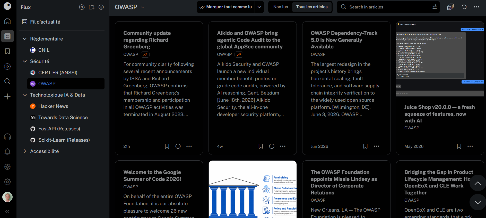
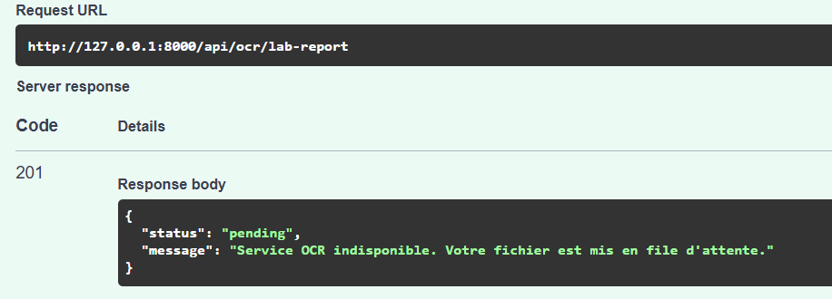
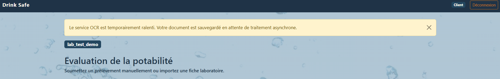
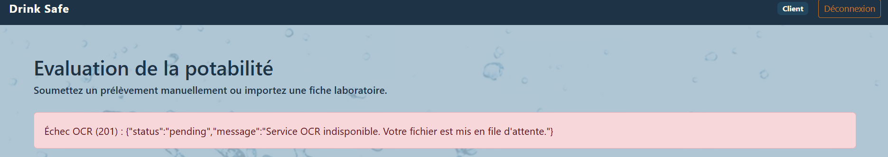

# Evaluation - E 2
## Intégrer des modèles et des services d’intelligence artificielle
Bloc de compétences 2<br>
référence : REAC page 5-9<br>
Rapport de 15 à 20 pages

---

## Sommaire

- [C6. Organiser et réaliser une veille technique et réglementaire](#c6-organiser-et-réaliser-une-veille-technique-et-réglementaire)
en animant le travail collectif de sélection des sources, de collecte, de traitement et de partage des informations afin de formuler des recommandations pour le projet toujours en phase avec l’état de l’art.

- [C7. Identifier des services d’intelligence artificielle préexistants](#c7-identifier-des-services-dintelligence-artificielle-préexistants)
à partir de l’expression de besoin en fonctionnalités d’intelligence artificielle, en réalisant un benchmark de services existants et en analysant leurs caractéristiques pour formaliser une ou plusieurs recommandations de services adaptés au besoin.

- [C8. Paramétrer un service d’intelligence artificielle](#c8-paramétrer-un-service-dintelligence-artificielle)
en suivant sa documentation technique et en respectant les spécifications du projet, afin de permettre l’intégration des connecteurs du service dans le système d’information.

---
---
---

## Introduction et Contexte du Projet
Le présent livrable s'inscrit dans le cadre du développement de la plateforme [Drink Safe](https://github.com/bruno-coulet/drink_safe), un système d'aide à la décision conçu pour une collectivité territoriale.<br>
Cette plateforme a pour mission de centraliser et d'automatiser l'analyse de la potabilité de l'eau en s'appuyant sur des modèles de Machine Learning.<br>

L'architecture applicative a été conçue pour répondre aux besoins de trois types d'utilisateurs clés :
- **L'Agent de terrain (Client)**<br>
Soumet les prélèvements d'eau et obtient un verdict de potabilité.
- **L'Analyste Qualité**<br>
Supervise la cohérence des prélèvements et surveille les performances de l'IA (MLflow).
- **Le Responsable d'Exploitation**<br>
Assure le maintien en condition opérationnelle (MCO) et la supervision de l'API.


Expression et reformulation du besoin en Intelligence Artificielle Lors de la phase de conception Agile, l'analyse des cas d'usage a mis en évidence un point de friction majeur (goulot d'étranglement) pour les Agents de terrain :<br>
la saisie manuelle et rébarbative des dizaines de mesures physico-chimiques issues des rapports de laboratoires (souvent transmis au format PDF ou image).<br>

Afin de fluidifier cette étape et de limiter les erreurs de saisie humaine, la **User Story** suivante a été intégrée au backlog :<br>
"En tant qu'agent de terrain, je veux pouvoir téléverser directement une photo ou un fichier PDF de ma fiche de laboratoire, afin qu'un service d'Intelligence Artificielle en extraie automatiquement les données physico-chimiques nécessaires à la prédiction."
C'est pour répondre à cette problématique spécifique d'extraction d'informations non structurées que la recherche et l'intégration d'un service OCR (Optical Character Recognition) ont été planifiées et sont détaillées dans ce document.

<div style="page-break-after: always;"></div>

## C6. Organiser et réaliser une veille technique et réglementaire
<blockquote>En animant le travail collectif de sélection des sources, de collecte, de traitement et de partage des informations afin de formuler des recommandations pour le projet toujours en phase avec l’état de l’art.</blockquote>
-

Dans un écosystème technologique aussi mouvant que celui de l'Intelligence Artificielle et du développement web, les frameworks, les modèles de Machine Learning et les lois évoluent à une vitesse fulgurante.<br>
Afin de garantir que les choix architecturaux et réglementaires du projet Drink Safe soient toujours en phase avec l'état de l'art, j'ai mis en place un dispositif de veille automatisé, structuré et collaboratif
.
### Définition des thématiques de veille
Conformément aux enjeux de la plateforme Drink Safe, j'ai ciblé ma veille sur deux piliers stratégiques
 :
1. La  réglementation
2. La cybersécurité


- L'évolution du RGPD ([CNIL](https://www.cnil.fr/fr/professionnel)) concernant l'anonymisation des données personnelles de santé (comme les prélèvements d'eau).
- Le suivi de l'IA Act européen pour anticiper les contraintes de transparence des algorithmes.
- Les évolutions des standards de sécurité applicative (OWASP) concernant les API REST.
- La veille technologique et MLOps :
- L'évolution des algorithmes de Machine Learning sur données tabulaires (XGBoost, Scikit-Learn).
- Les nouveaux services d'extraction d'information depuis des documents non structurés (OCR et Vision LLMs).
- Les bonnes pratiques d'observabilité (Prometheus/Grafana) et de registre de modèles (MLflow).


### Outils d'automatisation et de collecte
Pour éviter une recherche manuelle chronophage et inefficace, j'ai automatisé la collecte d'informations via un agrégateur de flux RSS
. J'ai choisi la solution [Inoreader](https://www.inoreader.com/) pour sa capacité à :
- classer les sources par dossiers thématiques
- centraliser les alertes
- gratuit jusqu'à 150 flux
- configuration de règles strictes pour isoler le signal du bruit
- intègration possible pour automatiser des exports ou requêter les flux via API en Python ou en Bash.

Néanmoins, pour filtrer des mots-clés sans payer, il faut au préalable faire une sélection via [siftrss](https://siftrss.com/)<br>
Ce site permet de :
- selectionner une source
- paramétrer les filtres
- générer une URL qu'il faut ensuite importer dans **Inoreader**


##### *Interface Inoreader - dossiers de veille classés par thème*



### Qualification et sélection des sources
La fiabilité des informations est primordiale pour ne pas baser l'architecture du projet sur des informations erronées. Chaque source intégrée à mon agrégateur a été rigoureusement qualifiée selon trois critères stricts :
- la notoriété de l'auteur
- l'absence de conflits d'intérêts commerciaux
- la récence de publication.

#### Liste des flux certifiés
##### Sources institutionnelles (Légales)
- Le flux RSS de la CNIL (référence absolue pour la conformité RGPD)
- publications de l'ANSSI pour l'hygiène informatique de nos serveurs.
##### Sources Cybersécurité
- blog officiel de la fondation OWASP

##### Sources Techniques (IA)
- agrégateur communautaire Hacker News (YCombinator) pour les signaux faibles
- blog d'ingénierie Towards Data Science
- notes de version (Release Notes) des dépôts GitHub de FastAPI et MLflow.

### Organisation et Planification
La veille perd de sa valeur si elle n'est pas régulière. J'ai instauré une routine stricte en bloquant un créneau fixe d'une heure chaque semaine (le vendredi matin de 9h à 10h) pour lire, trier et traiter les dizaines de flux remontés par l'agrégateur.

### Exemples concrets : Synthèses et Fiches de lecture
Afin d'illustrer l'impact direct de cette veille sur le projet Drink Safe, voici trois synthèses d'articles majeurs que j'ai traités et partagés durant ma mission :

|Thématique|Fiche de lecture & Impact sur le projet|
|-|-|
|Cybersécurité (OWASP)|**Top 10 API Security Risks 2023 Update**<br>**Source :** OWASP Foundation<br>**Synthèse :** L'OWASP a mis à jour ses recommandations, plaçant la faille Broken Authentication (BOLA) comme risque critique majeur pour les API REST. L'article détaille comment de nombreuses API exposent les données en se basant uniquement sur la confiance du client.<br>**Impact sur Drink Safe  :** Cette lecture m'a poussé à implémenter un hachage asymétrique (SHA-256) des clés API en base de données, et à filtrer systématiquement les requêtes SQL avec une clause WHERE client_id = :id pour garantir un cloisonnement Multi-Tenancy strict.|
|Réglementation (RGPD)|**Intelligence Artificielle : le guide d'anonymisation des données de la CNIL**<br>**Source :** Blog de la CNIL<br>**Synthèse :** La CNIL rappelle que les données utilisées pour entraîner des modèles d'IA ou stockées pour de l'inférence doivent subir un processus d'anonymisation irréversible si elles ne sont pas strictement nécessaires au fonctionnement du service.<br>**Impact sur Drink Safe  :** J'ai intégré un middleware d'audit qui anonymise la clé API du client avant chaque écriture dans la table action_logs. De plus, les données physico-chimiques sont stockées sans aucune métadonnée nominative (Privacy by Design).|
|Veille Technologique|**L'évolution des performances du format Parquet vs CSV pour les DataFrames**<br>**Source :** Towards Data Science / Hacker News<br>**Synthèse :** Un benchmark démontrant qu'une lecture en format compressé colonnaire (Parquet) est jusqu'à 50 fois plus rapide et moins gourmande en RAM que le parsing d'un fichier CSV traditionnel.<br>**Impact sur Drink Safe / Mobilités :** C'est cette veille qui a motivé le choix de migrer l'historique massif des données vers le système Big Data basé sur les fichiers .parquet et l'utilisation de DuckDB pour la requête analytique en mémoire, optimisant ainsi l'empreinte carbone et la vélocité de l'API.|
|Veille Technologique & Green IT|**Consommation énergétique des Vision-LLMs vs OCR traditionnels**<br>**Source :** Towards Data Science / Rapports de recherche IA<br>**Synthèse :** L'émergence des modèles génératifs multimodaux (comme GPT-4V ou Claude 3) permet d'extraire des données de fiches laboratoires avec une syntaxe naturelle. Cependant, l'article démontre que l'inférence d'un LLM consomme jusqu'à 50 fois plus d'énergie et de ressources de calcul (GPU) qu'un moteur OCR spécialisé classique, pour un résultat d'extraction de données tabulaires souvent similaire.<br>**Impact sur Drink Safe :** Cette veille a conforté mon choix technique d'écarter les IA génératives (LLMs) pour ce besoin précis. Utiliser un service OCR standard (comme OCR.space) aligne parfaitement le projet avec nos objectifs d'éco-conception (Green IT) en évitant le gaspillage de puissance de calcul pour une tâche d'extraction simple.|


### Partage et Accessibilité
Une veille n'a de valeur que si elle est partagée au reste de l'équipe (Analystes Qualité, Responsables d'Exploitation). À l'issue de mon créneau hebdomadaire, je rédige les fiches de synthèse (comme celles ci-dessus) que je diffuse via un canal de communication asynchrone (Slack ou tableau Trello).

#### Engagement d'accessibilité numérique
Conformément aux engagements du projet et pour garantir que l'information soit accessible à tous les membres de l'équipe (y compris ceux utilisant des lecteurs d'écran), ces synthèses sont systématiquement formatées pour respecter les recommandations d'accessibilité numérique
. Je m'appuie sur la hiérarchie sémantique stricte de l'information (balisage Markdown H1, H2) et la vérification des contrastes visuels, en suivant les préconisations de l'association Valentin Haüy et du standard français RGAA


- **Sources réglementaires officielles**<br>
    - [CNIL](https://www.cnil.fr/fr/professionnel) La référence absolue pour le RGPD
    - publications de l'[ANSSI](https://cyber.gouv.fr/reglementation/cybersecurite-systemes-dinformation/).
- **Sources sécurité**<br>
    Le blog de la fondation [OWASP](https://owasp.org/news/#).
- **Sources techniques**
    - Agrégateurs communautaires validés par les pairs [Hacker News](https://news.ycombinator.com/news)
    - blogs d'ingénierie reconnus [Towards Data Science](https://towardsdatascience.com/)
    - documentations officielles des frameworks (FastAPI, scikit-learn).
- **Sources accessibilité**<br>
 [Valentin Haüy](https://www.avh.asso.fr/nos-solutions/accessibilite/accessibilite-numerique) et du standard [RGAA](https://accessibilite.numerique.gouv.fr/)


<div style="page-break-after: always;"></div>

## C7. Identifier des services d’intelligence artificielle préexistants
>à partir de l’expression de besoin en fonctionnalités d’intelligence artificielle, en réalisant un benchmark de services existants et en analysant leurs caractéristiques pour formaliser une ou plusieurs recommandations de services adaptés au besoin.


Afin de répondre à la **User Story** de l'*agent de terrain* ("éviter la saisie manuelle en téléversant une fiche laboratoire"), j'ai dû identifier un service d'Intelligence Artificielle capable d'extraire le texte (OCR) depuis des documents non structurés (PDF, PNG, JPG).

Pour répondre à ce besoin d'extraction documentaire, j'ai réalisé une étude comparative approfondie de trois services d'Intelligence Artificielle de reconnaissance optique de caractères (OCR)

>OCR : Optical caracter recognition / Reconnaissance Optique de Caractères

## Expression du besoin et contraintes du projet

**Objectif fonctionnel :**
Extraire automatiquement les valeurs numériques de 9 mesures physico-chimiques depuis un rapport d'analyse d'eau.

**Contraintes techniques :**
La solution doit s'intégrer facilement via une requête HTTP asynchrone à notre API métier (FastAPI), sans alourdir l'empreinte mémoire du serveur local.

**Contraintes métiers :**
Budget limité (MVP) et respect du RGPD.


## Benchmark des solutions existantes
J'ai étudié trois approches distinctes pour répondre à ce besoin

Afin de sélectionner la solution la plus adaptée à notre architecture FastAPI et à nos contraintes de production (MVP), j'ai évalué ces solutions selon 6 critères pondérés :
- l'architecture technique
- les performances brutes
- le coût financier
- la facilité d'intégration logicielle
- le respect du RGPD
- l'impact écologique (Green IT)

<div style="page-break-after: always;"></div>

|Critères d'évaluation|Tesseract OCR|Google Cloud Vision|OCR.space (Retenue)|
|-|-|-|-|
|Type de service|Open-source (Local)|API SaaS (Cloud public GAFAM)|API REST (Cloud Freemium)|
|Performances (PDF mal scannés)|Moyennes (nécessite OpenCV en amont)|Excellentes (État de l'art IA)|Très bonnes (Moteur optimisé pour les tableaux)|
|Coût d'exploitation (MVP)|Gratuit (0€)|Payant (Nécessite une carte bancaire)|Gratuit (Free Tier de 25 000 req/mois)|
|Facilité d'intégration Python|Complexe (Wrapper pytesseract)|Moyenne (SDK lourd google-cloud-vision)|Très simple (Requête HTTP via requests)|
|Contraintes d'infrastructure|Lourdes (Installation de binaires C++ dans Docker)|Légères (Appel réseau distant)|Légères (Appel réseau distant)|
|Souveraineté & RGPD|Excellente (Aucune donnée ne sort du serveur)|Risquée (Transfert potentiel vers des serveurs hors UE)|Bonne (Possibilité de forcer les serveurs européens)|Impact Écologique (Green IT)|Élevé (Forte sollicitation du CPU local à chaque inférence)|Modéré (Opacité sur le mix énergétique des Data Centers US)|Optimisé (Mutualisation de la puissance de calcul IA)

### Analyse détaillée et justification des rejets
Chaque solution a été évaluée pour justifier son adéquation ou son rejet.

### Solution 1 - **Tesseract OCR** (Open Source & Local)

Tesseract est un moteur historique très respectueux de la confidentialité puisque le traitement se fait en local sur la machine hôte

**Adéquation :** Bonne.

**Contraintes techniques :** Très forte.
Nécessite d'installer des binaires lourds (``libtesseract``) dans le conteneur Docker de l'API, ce qui alourdit considérablement l'image et la consommation CPU.
De plus, les performances sur des PDF mal scannés nécessitent beaucoup de pré-traitement (OpenCV).

**Bilan :** Écarté<br>
Surcoût de complexité d'infrastructure pour un simple MVP.<br>
Son intégration est techniquement inadaptée à notre architecture basée sur des conteneurs légers.<br>
Tesseract exige l'installation de bibliothèques système lourdes (``libtesseract-dev``) qui feraient exploser le poids de notre image Docker
.<br>
De plus, le traitement OCR est extrêmement gourmand en ressources CPU, ce qui risquerait de saturer le serveur hébergeant notre API FastAPI lors de requêtes simultanées.

### Solution 2 - **Google Cloud Vision API** (Service SaaS GAFAM)

C'est la solution technologique la plus aboutie du marché, capable de lire des documents extrêmement dégradés

**Adéquation :** Excellente.

La reconnaissance de texte est l'une des plus puissantes du marché.

**Contraintes techniques et RGPD :**

Nécessite la configuration complexe d'une Service Account Key (IAM) et l'enregistrement d'une carte bancaire. Les données sont envoyées sur des serveurs américains.

**Bilan :** Écarté.

- Solution surdimensionnée (overkill) pour notre MVP
- Son intégration pose un problème de complexité administrative pour la collectivité territoriale commanditaire : elle exige la création d'un compte IAM complexe (Service Account Key) et l'enregistrement obligatoire d'une carte bancaire

- l'envoi de rapports d'analyses d'eau vers des serveurs potentiellement soumis au Cloud Act américain pose un risque de souveraineté

### Solution 3 - **OCR.space** (API REST Freemium)
**Adéquation :** Très bonne.
Le service prend en charge nativement les PDF et les images, et renvoie un fichier JSON brut facile à traiter (via des expressions régulières) directement dans FastAPI.

**Éco-responsabilité :** Mutualise la puissance de calcul sur un service Cloud spécialisé et optimisé pour l'OCR permet de réduire la consommation énergétique de nos propres serveurs (démarche Green IT locale).

**Contraintes techniques :**
Dépendance à la disponibilité du réseau externe.

## Conclusion et Préconisation À l'issue de l'analyse comparative
Je préconise l'intégration du service **[OCR.space](https://ocr.space/)**

C'est la solution la plus pragmatique :
- offre un tier gratuit (Free Tier) suffisant pour le volume attendu par la collectivité
- s'intègre nativement à notre API FastAPI via la librairie `requests`
- n'alourdit pas notre infrastructure Docker.

Pour pallier la contrainte de dépendance réseau, je prévois d'implémenter un mécanisme de secours [fallback gracieux](/E4.md#c17-développer-les-composants-techniques-et-les-interfaces-dune-application) dans le code pour gérer les potentiels temps d'arrêt de l'API externe.


**Alignement fonctionnel :** Il gère nativement le format PDF (contrairement à de nombreuses API qui n'acceptent que les images) et renvoie un dictionnaire JSON structuré
 facile à analyser dans FastAPI via des expressions régulières (Regex)


**Adéquation budgétaire :** Son modèle Freemium garantit 25 000 requêtes gratuites par mois, ce qui couvre très largement les besoins initiaux du MVP de la collectivité territoriale


**Démarche Éco-responsable (Green IT) :** Confier l'extraction documentaire à un service Cloud dont l'infrastructure matérielle est spécifiquement optimisée pour l'IA permet de mutualiser les ressources
. Cela évite de faire tourner des processeurs à plein régime sur notre propre serveur pour une tâche ponctuelle, réduisant ainsi notre empreinte énergétique globale

<div style="page-break-after: always;"></div>

## C8. Paramétrer un service d’intelligence artificielle
>en suivant sa documentation technique et en respectant les spécifications du projet, afin de permettre l’intégration des connecteurs du service dans le système d’information.

Afin d'intégrer le service préconisé (OCR.space) dans la plateforme Drink Safe, j'ai procédé à son paramétrage technique et à sa sécurisation au sein de notre API FastAPI.
### Création de l'environnement et gestion des accès
J'ai créé un compte SaaS sur le tier gratuit d'**OCR.space** afin de générer une clé d'authentification unique. Pour des raisons de sécurité, cette clé n'est jamais écrite en dur dans le code source. Elle est stockée de manière sécurisée dans les variables d'environnement du serveur (fichier `.env`) et chargée dynamiquement au démarrage du conteneur Docker.
### Paramétrage des dépendances et interconnexion
Le sous-module `src/routes/ocr.py` de notre API communique avec le service via la librairie standard Python `requests`.

Le paramétrage de l'API tierce a été optimisé pour le besoin métier en suivant la [documentation officielle de l'API OCR.space]():
`language='fre'`<br>
Optimisation du moteur de reconnaissance pour le français.

`isTable=True`<br>
Activation du parsing en tableau pour mieux respecter l'alignement des colonnes des fiches laboratoires.

`isOverlayRequired=False`<br>
Désactivation des coordonnées spatiales du texte (Bounding Boxes) pour alléger le poids du payload JSON retourné et économiser de la bande passante.

`scale=True`<br>
Amélioration automatique de la résolution et de la lisibilité, particulièrement utile pour les fiches laboratoires scannées au format PDF.

[waterflow/src/routes/ocr.py](https://github.com/bruno-coulet/drink_safe/blob/main/src/routes/ocr.py) :
```python
payload_ocr: Dict[str, Any] = {
    "apikey": ocr_api_key,
    # Gestion des accents français
    "language": "fre",
    # Maintien de l'alignement des valeurs
    "isTable": "true",
    # Optimisation réseau et RAM
    "isOverlayRequired": "false",
    # Amélioration de la lecture
    "scale": "true"
}
```


### Cinématique d'intégration et Flux de données (Data Flow)
L'intégration du service OCR au sein de l'architecture Drink Safe suit une cinématique réseau stricte et asynchrone, conçue pour garantir la sécurité et la fluidité de l'application :
- Vérification Frontend<br>
L'agent de terrain téléverse sa fiche laboratoire via l'interface Flask. Une vérification du type MIME (PDF, PNG, JPG) et de la taille du fichier (< 5 Mo) est effectuée pour éviter de surcharger la bande passante.

- Transfert Sécurisé vers l'API<br>Le Frontend envoie le document sous forme de requête multipart/form-data vers la route ``/api/ocr/lab-report`` du backend FastAPI, en y joignant la clé d'authentification du client (X-API-Key).

- Appel au Service Tiers (IA)<br>
FastAPI réceptionne le fichier et forge une nouvelle requête HTTP vers les serveurs européens d'OCR.space, en y injectant notre clé API privée secrète (récupérée depuis les variables d'environnement ``.env``). FastAPI attend la réponse de manière asynchrone pour ne pas bloquer les autres utilisateurs de la plateforme.

- Validation et Nettoyage<br>
À la réception du JSON renvoyé par l'IA, l'API métier exécute ses algorithmes d'expressions régulières (détaillés en annexe) pour extraire les mesures.

- Enrichissement et Persistance<br>
Le dictionnaire de valeurs extraites est validé par le schéma Pydantic de FastAPI. Si tout est conforme, la requête SQL INSERT est exécutée dans PostgreSQL, et le Frontend est notifié de la réussite de l'opération avec l'ID du nouveau prélèvement créé.<br>

Cette architecture fortement découplée permet de s'assurer que si l'API OCR.space venait à changer son format de réponse à l'avenir, seul le composant de Parsing (Étape 4) de notre FastAPI nécessiterait une mise à jour, sans impacter ni la base de données ni l'interface client.


### Traitement des données et Parsing L'API OCR.space
renvoie un JSON contenant un bloc de texte brut monolithique (ParsedText).
J'ai paramétré une logique d'extraction spécifique côté serveur (via des expressions régulières - Regex) pour scanner ce texte brut, isoler les 9 noms de molécules, et extraire les valeurs numériques associées afin de les typer en float via Pydantic.

#### Exemple de traitement d'extraction (Python Regex)
Lorsque l'API OCR.space traite le fichier, elle retourne un dictionnaire JSON volumineux.<br>
La clé ``ParsedText`` contient l'intégralité du texte brut lu sur la fiche de laboratoire.<br>
Afin d'isoler nos 9 mesures physico-chimiques (pH, Conductivité, Dureté, etc.) de ce texte brut, j'ai développé une logique de parsing robuste s'appuyant sur la librairie standard Python ``re``.

La logique complète d'extraction par expressions régulières, l'incrémentation de la métrique de surveillance Prometheus OCR_FAILURES, ainsi que l'insertion sécurisée des données dans la base PostgreSQL sont détaillées dans l'Annexe [parsing_ocr](/annexes/parsing_ocr.md) : Traitement de la réponse OCR et persistance en base de données à la fin de ce document."

Grâce à ce traitement côté serveur, les données sont nettoyées, castées en type float, puis validées par notre schéma Pydantic avant d'être soumises aux modèles de Machine Learning. Ce processus garantit l'intégrité de la base de données PostgreSQL, même si le document scanné comporte des imperfections de mise en page.


## Validation fonctionnelle du paramétrage
Pour valider les paramètres envoyés à l'API OCR.space :<br>
```python
isTable=true
scale=true
language='fre'
```
 et vérifier la robustesse de l'algorithme d'expressions régulières en conditions réelles, j'ai implémenté l'appel au service directement depuis l'interface client de la plateforme.
### Ingestion du document (Client)
L'Agent de terrain téléverse sa fiche d'analyse au format PDF ou image via le formulaire dédié de l'application Flask. Ce formulaire forge la requête HTTP multipart sécurisée envoyée à notre API.

##### *Interface d'ingestion permettant à l'Agent de déclencher le service OCR tiers*


### Retour du service et Extraction (Serveur)
Une fois le document traité par l'IA d'OCR.space, l'API FastAPI réceptionne le dictionnaire JSON. Le payload retourné au Frontend, visible ci-dessous :
###### *Payload confirmant l'extraction structurée des mesures physico-chimiques par Regex*


 prouve que la logique métier a parfaitement fonctionné : les 9 paramètres physico-chimiques (Conductivité, Chloramines, pH, etc.) ont été extraits du texte brut, isolés, et castés avec succès au format numérique (float).<br>
Les données sont ainsi prêtes et formatées pour être soumises au modèle de Machine Learning.

### Monitorage et Résilience du service
L'intégration d'un service externe introduit un risque de défaillance réseau. J'ai donc configuré un monitoring spécifique (intégré à la supervision globale de l'application) :

- **Supervision des échecs :**
Chaque erreur de l'API OCR (Timeout, dépassement de quota) incrémente automatiquement une métrique Prometheus spécifique `ocr_failures_total`.


- **Fallback (Dégradation gracieuse) :**
Si le service externe est hors ligne (Timeout) ou si le quota est dépassé, un bloc ``try/except`` intercepte l'erreur.
Au lieu de faire crasher le conteneur API, l'application renvoie un statut de succès partiel ``HTTP 201`` (pending) à l'interface client<br>


 ##### *Interception de la panne par l'API Backend et renvoi d'un statut "pending"*
  

*Service OCR indisponible...*
se déclenche si le code plante pour une raison totalement inattendue qui n'est pas liée au réseau

Ce statut est ensuite proprement intercepté par le Frontend Flask. Plutôt que d'afficher une erreur technique fatale (Jinja2) à l'Agent de terrain, j'ai implémenté deux niveaux d'avertissements selon la nature de la panne pour préserver l'expérience utilisateur et la continuité du service :

##### *1. Restitution d'un message clair en cas de panne réseau*


Ce comportement se déclenche lorsqu'une erreur purement réseau ou de timeout se produit de manière identifiée (interceptée spécifiquement via ``except requests.RequestException as e:``).<br>
L'interface affiche un message d'avertissement ergonomique :


##### *2. Restitution d'une erreur inattendue (Generic Exception)*

Ce second comportement se déclenche en secours si le code plante pour une raison totalement inattendue qui n'est pas directement liée au réseau. L'interface affiche le retour d'erreur complet pour faciliter le débogage par le support technique


<div style="page-break-after: always;"></div>


## Conclusion
L'intégration de la fonctionnalité d'extraction documentaire au sein de la plateforme **Drink Safe** démontre une maîtrise complète du cycle d'intégration d'un service d'Intelligence Artificielle tiers.<br>
Grâce à la mise en place d'une veille technologique et réglementaire structurée [C6](#c6-organiser-et-réaliser-une-veille-technique-et-réglementaire), il a été possible de définir des critères de sélection rigoureux et en phase avec l'état de l'art.<br>
La réalisation d'un benchmark multicritères [C7](#c7-identifier-des-services-dintelligence-artificielle-préexistants) a permis d'écarter les solutions inadaptées (trop lourdes ou posant des risques de souveraineté) au profit d'une API externe (OCR.space) respectant les contraintes du MVP et les principes du Green IT.<br>
Enfin, le paramétrage technique de ce service [C8](#c8-paramétrer-un-service-dintelligence-artificielle) a été réalisé en maximisant les performances de lecture (Regex, orientation tableau), tout en garantissant un haut niveau de sécurité (variables d'environnement) et de résilience (monitoring Prometheus et dégradation gracieuse en deux niveaux sur l'interface).
Ces choix architecturaux et opérationnels valident la bonne intégration d'un service d'IA préexistant au cœur d'un système d'information moderne, robuste et centré sur l'utilisateur.


## Glossaire Technique
- API (Application Programming Interface)<br>
Interface permettant à différentes applications informatiques de communiquer entre elles. Dans ce projet, notre architecture repose sur une API REST construite avec FastAPI.
- Fallback (Dégradation Gracieuse)<br>Principe d'architecture logicielle permettant à un système de continuer à fonctionner, de manière potentiellement restreinte, en cas de défaillance d'un de ses composants (ex: panne réseau du service OCR).
- Green IT (Éco-conception)<br>Démarche visant à réduire l'empreinte écologique du numérique, ici appliquée en limitant le temps de calcul des serveurs et en mutualisant les ressources IA.
- JSON (JavaScript Object Notation)<br>Format standardisé et léger d'échange de données. C'est le format utilisé par l'API OCR.space pour nous renvoyer les textes extraits.
- OCR (Optical Character Recognition)<br>Technologie d'Intelligence Artificielle de "Reconnaissance Optique de Caractères" permettant de traduire une image ou un fichier PDF contenant du texte en un fichier texte exploitable par une machine.
- OWASP (Open Worldwide Application Security Project)<br>Fondation mondiale établissant les standards et les recommandations en matière de sécurité des applications web et des API (prévention des piratages).
- Regex (Expression Régulière)<br>Chaîne de caractères définissant un motif de recherche précis. Utilisées dans ce projet pour repérer les valeurs chimiques dans le texte brut lu par l'OCR.
- RGPD<br>Règlement Général sur la Protection des Données. Les mesures intégrées au projet (anonymisation des logs) visent à garantir la confidentialité des utilisateurs de la collectivité.


