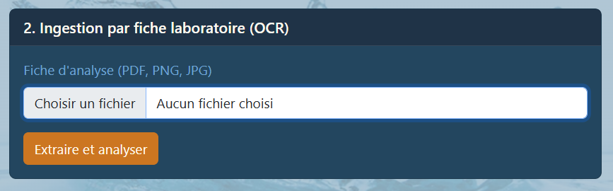
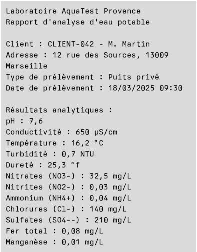
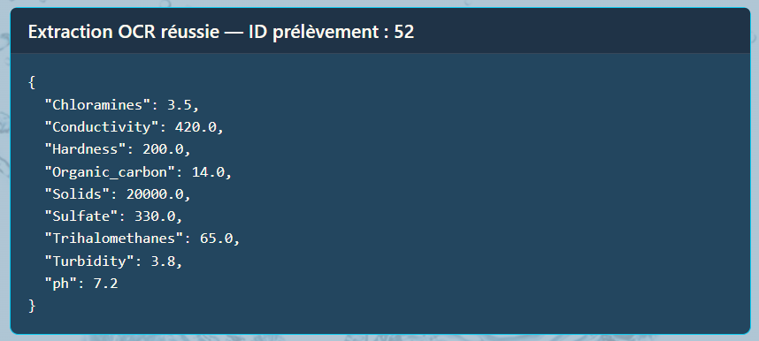
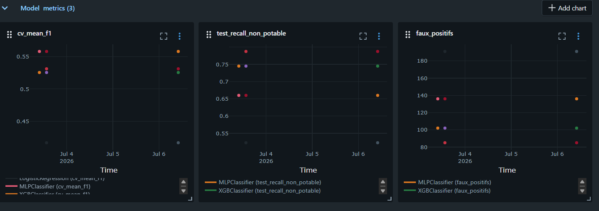
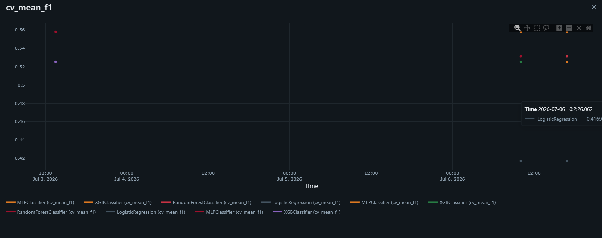
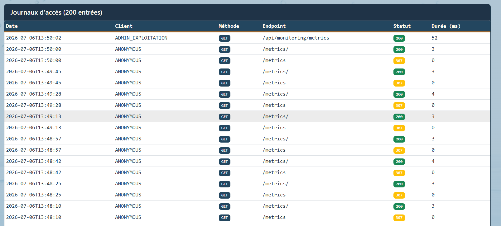
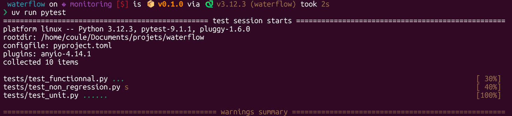
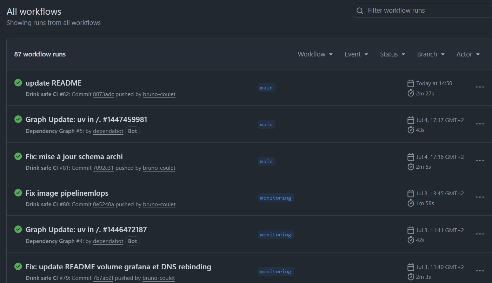

# Evaluation - E 3
## Réaliser une application intégrant un service d’intelligence artificielle
Bloc de compétences 2
référence : REAC page 10-16
Rapport de 15 à 20 pages

## Sommaire

- [C9. Développer une API exposant un modèle d’intelligence artificielle](#c9-développer-une-api-exposant-un-modèle-dintelligence-artificielle)
en utilisant l’architecture REST pour permettre
l’interaction entre le modèle et les autres composants du projet.

- [C10. Intégrer l’API d’un modèle ou d’un service d’intelligence artificielle](#c10-intégrer-lapi-dun-modèle-ou-dun-service-dintelligence-artificielle).
en respectant les
spécifications du projet et les normes d’accessibilité en vigueur, à l’aide de la documentation technique de l’API, afin de
créer les fonctionnalités d’intelligence artificielle de l’application.
- [C11. Monitorer un modèle d’intelligence artificielle](#c11-monitorer-un-modèle-dintelligence-artificielle).
en intégrant les outils de collecte, d’alerte et de restitution des données du monitorage pour permettre l’amélioration du
modèle de façon itérative.
- [C12. Programmer les tests automatisés d’un modèle d’intelligence artificielle](#c12-programmer-les-tests-automatisés-dun-modèle-dintelligence-artificielle).
en définissant les règles de validation des jeux de données, des étapes de préparation des données, d'entraînement, d’évaluation et de validation du modèle pour
permettre son intégration en continu et garantir un niveau de qualité élevé.
- [C13. Créer une chaîne de livraison continue d’un modèle d’intelligence artificielle](#c13-créer-une-chaîne-de-livraison-continue-dun-modèle-dintelligence-artificielle).
en installant les outils et en appliquant les configuration souhaitées, dans le respect du cadre imposé par le projet et dans une approche MLOps*,
pour automatiser les étapes de validation, de test, de packaging* et de déploiement du modèle.

---
---
---

## C9. Développer une API exposant un modèle d’intelligence artificielle
>en utilisant l’architecture REST pour permettre l’interaction entre le modèle et les autres composants du projet.

Plateforme [Drink safe](https://github.com/bruno-coulet/drink_safe)

### Architecture REST et Choix Techniques
L'API a été développée en Python en utilisant le framework **[FastAPI](https://fastapi.tiangolo.com/fr/tutorial/)** Ce choix se justifie par sa validation native des données via [Pydantic](https://pydantic.dev/) (sécurisation des inputs) et sa génération automatique de la documentation [OpenAPI](https://www.openapis.org/) (Swagger).
L'API Unique est structurée de manière modulaire, exposant une route de prédiction dédiée :
`POST /api/predict/all`.

### Sécurisation et Top 10 OWASP
L'accès au modèle est strictement protégé.
J'ai implémenté un Middleware d'authentification exigeant la présence d'une `X-API-Key` dans les en-têtes HTTP.
 Conformément aux recommandations OWASP (Broken Authentication), les clés API sont hachées en base de données PostgreSQL.
 De plus, des "garde-fous" sanitaires (règles métiers OMS) sont codés en dur dans l'API : si un prélèvement présente un pH < 6.5 ou une turbidité > 5.0 NTU, l'API rejette l'échantillon immédiatement sans solliciter le modèle.

---
---
## C10. Intégrer l’API d’un modèle ou d’un service d’intelligence artificielle.
>dans une application, en respectant les spécifications du projet et les normes d’accessibilité en vigueur, à l’aide de la documentation technique de l’API, afin de
créer les fonctionnalités d’intelligence artificielle de l’application.

Pour répondre au besoin des agents de terrain d'éviter la saisie manuelle des fiches laboratoires, j'ai intégré un service d'Intelligence Artificielle d'extraction de texte (OCR).

### Intégration du Service Externe OCR.space
L'API Drink Safe fait appel au service Cloud **[OCR.space](https://ocr.space/)** de manière asynchrone.
La route `POST /api/ocr/lab-report` reçoit le fichier (PDF ou Image) de l'utilisateur, l'envoie de manière sécurisée à l'API OCR, puis "parse" le retour JSON via des expressions régulières (Regex) pour extraire les 9 mesures physico-chimiques requises.

### Couche de présentation (Frontend Flask)
Pour l'interaction humaine, j'ai développé une interface sous **Flask** (Port 5001) tournant sur la machine hôte. Ce frontend agit comme un client de l'API. Il gère l'authentification des experts, le téléversement des fiches PDF, et interroge l'API métier sur `localhost:8000` pour afficher les tableaux de bord et les prédictions (Potable / Non Potable) de manière accessible.

*capture d'écran du code de la route `/ocr` et une capture de l'interface Flask montrant le téléversement d'une fiche*
*Ingestion OCR - UI*

*Ingestion OCR - fichier .png*

*Ingestion OCR - payloadg*

---

## C11. Monitorer un modèle d’intelligence artificielle
à partir des métriques courantes et spécifiques au projet, en intégrant les outils de collecte, d’alerte et de restitution des données du monitorage pour permettre l’amélioration du
modèle de façon itérative.

La supervision en production est vitale pour garantir qu'aucune "dérive" (drift) n'affecte les prédictions de potabilité.

### Architecture de Monitoring MLOps (MLflow)
J'ai conteneurisé un serveur de tracking **MLflow** (exposé sur le port 5000), couplé à PostgreSQL (Backend Store) et à un volume physique (Artifact Store). L'API FastAPI utilise un mécanisme de *Lazy Loading* pour venir piocher dynamiquement le modèle validé en production.

### Métriques et Traçabilité (Audit RGPD)
Les expériences tracent des métriques critiques, notamment l'Accuracy, le F1-Score et l'AUC-PR (adapté au déséquilibre des classes du dataset). Parallèlement, un audit trail est mis en place via la table `action_logs` dans PostgreSQL. Ce système journalise (temps de réponse, statuts HTTP 200/401/500, identifiant client) chaque appel d'inférence, permettant au Responsable d'Exploitation de détecter les anomalies réseau ou de sécurité.

*interface MLflow - métriques*

*interface MLflow - f1 moyenne*

*table `action_logs`*

---

## C12. Programmer les tests automatisés d’un modèle d’intelligence artificielle
en définissant les règles de validation des jeux de données, des étapes de préparation des données, d'entraînement, d’évaluation et de validation du modèle pour
permettre son intégration en continu et garantir un niveau de qualité élevé.

Pour garantir un haut niveau de qualité logicielle et prévenir les régressions en production, j'ai implémenté une suite de tests rigoureuse avec **PyTest**.

### Stratégie de tests sur 3 niveaux
1. **Tests Unitaires :** Ils valident les règles de gestion isolées. Par exemple, la fonction `test_garde_fou_oms_turbidite_elevee` vérifie que le système rejette bien une eau trouble sans faire appel au modèle ML, et `test_securite_cle_api` garantit le rejet des requêtes non authentifiées.
2. **Tests Fonctionnels (Bout en bout) :** Ils valident le cycle de vie complet. Un test simule la connexion à la BDD, le dépôt d'un fichier OCR, l'écriture dans PostgreSQL et l'inférence.
3. **Tests de Non-Régression (MLOps) :** Le script `test_non_regression.py` charge dynamiquement les modèles depuis MLflow et les évalue sur le dataset standardisé (`water_std.csv`). Il fait échouer le test si le F1-Score du modèle chute sous la barre d'acceptabilité de 60%.

*tests Pytest*

Pour valider cette stratégie, nous avons visé un taux de couverture de code d'environ 80% (mesuré avec l'outil `pytest-cov`), ce qui constitue un standard industriel solide, en nous concentrant en priorité sur les routes critiques de l'API et les règles métiers

---

## C13. Créer une chaîne de livraison continue d’un modèle d’intelligence artificielle
en installant les outils et en
appliquant les configuration souhaitées, dans le respect du cadre imposé par le projet et dans une approche MLOps*,
pour automatiser les étapes de validation, de test, de packaging* et de déploiement du modèle.

La chaîne d'Intégration et de Livraison Continue (CI/CD) a été pensée dans une stricte approche MLOps.

### Automatisation MLOps
L'entraînement des modèles n'est plus manuel. Il est encapsulé dans un conteneur éphémère (`mlops-training`). Lors de son lancement, il exécute un pipeline d'entraînement scikit-learn/XGBoost, valide les performances par validation croisée (5-folds), et sauvegarde automatiquement les artefacts `.pkl` dans un volume partagé (`./mlruns_artifacts`).

### Pipeline CI (GitHub Actions)
J'ai configuré un workflow GitHub Actions (`ci.yml`) qui se déclenche à chaque modification du code source (*Push* / *Pull Request*) . Ce pipeline installe l'environnement Python via `uv`, configure la base de données de test, et exécute automatiquement toute la suite de tests PyTest abordée dans la compétence C12. Ce n'est qu'en cas de succès que le code est jugé livrable.

*onglet "Actions" de GitHub*

