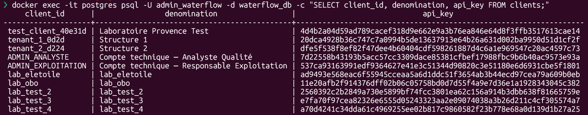
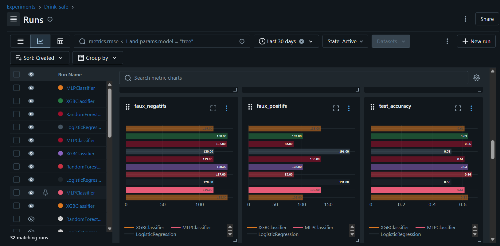
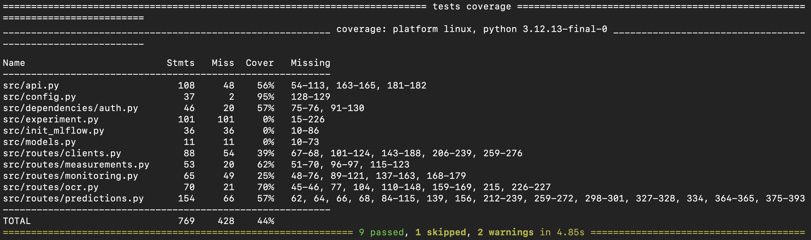
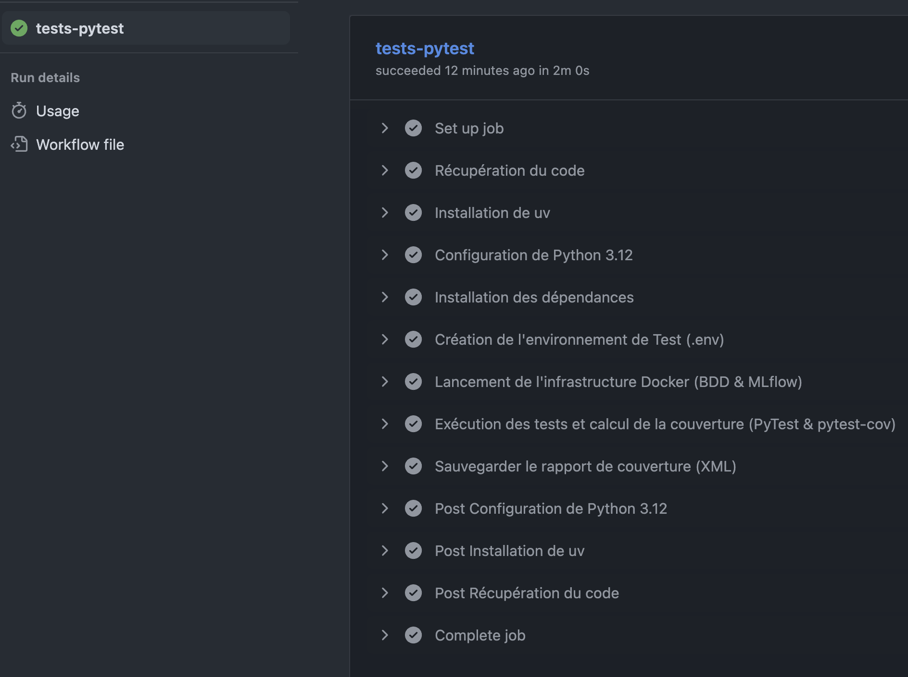

# Evaluation - E 3
## Réaliser une application intégrant un service d’intelligence artificielle
- Bloc de compétences 2
- référence : REAC page 10-16
- Rapport de 15 à 20 pages


## Sommaire

- [C9. Développer une API exposant un modèle d’intelligence artificielle](#c9-développer-une-api-exposant-un-modèle-dintelligence-artificielle)
en utilisant l’architecture REST pour permettre
l’interaction entre le modèle et les autres composants du projet.

- [C10. Intégrer l’API d’un modèle ou d’un service d’intelligence artificielle](#c10-intégrer-lapi-dun-modèle-ou-dun-service-dintelligence-artificielle).
en respectant les
spécifications du projet et les normes d’accessibilité en vigueur, à l’aide de la documentation technique de l’API, afin de
créer les fonctionnalités d’intelligence artificielle de l’application.
- [C11. Monitorer un modèle d’intelligence artificielle](#c11-monitorer-un-modèle-dintelligence-artificielle).
en intégrant les outils de collecte, d’alerte et de restitution des données du monitorage pour permettre l’amélioration du
modèle de façon itérative.
- [C12. Programmer les tests automatisés d’un modèle d’intelligence artificielle](#c12-programmer-les-tests-automatisés-dun-modèle-dintelligence-artificielle).
en définissant les règles de validation des jeux de données, des étapes de préparation des données, d'entraînement, d’évaluation et de validation du modèle pour
permettre son intégration en continu et garantir un niveau de qualité élevé.
- [C13. Créer une chaîne de livraison continue d’un modèle d’intelligence artificielle](#c13-créer-une-chaîne-de-livraison-continue-dun-modèle-dintelligence-artificielle).
en installant les outils et en appliquant les configuration souhaitées, dans le respect du cadre imposé par le projet et dans une approche MLOps*,
pour automatiser les étapes de validation, de test, de packaging* et de déploiement du modèle.

---
---
---


<div style="page-break-after: always;"></div>


## C9. Développer une API exposant un modèle d’intelligence artificielle
<blockquote>La documentation et l’API respectent les standards d’un modèle choisi (par exemple Open API). La documentation est communiquée dans un format qui respecte les recommandations d’accessibilité (par exemple celles de l’association Valentin Haüy ou de Microsoft).</blockquote>

Plateforme de référence : [Drink Safe](https://github.com/bruno-coulet/drink_safe)

### Architecture REST et Choix du Framework
Afin d'exposer les modèles d'intelligence artificielle aux différents clients de la plateforme, j'ai opté pour la création d'une API de type "Monolithe Modulaire" développée en Python avec le framework **`FastAPI`**. Ce choix architectural se justifie par plusieurs avantages décisifs pour un projet d'IA :
*   **Performance asynchrone :** L'inférence de modèles lourds nécessite une gestion non-bloquante des requêtes HTTP.
*   **Validation stricte (Pydantic) :** Les données entrantes (les mesures physico-chimiques) sont typées et validées nativement. L'API rejette automatiquement toute requête dont le format ne correspond pas au tenseur attendu par le modèle, évitant ainsi les crashs lors de l'inférence.

### Routage et Endpoints d'Inférence
Plutôt que d'exposer un seul point de terminaison monolithique, l'API décline l'accès aux modèles d'IA via plusieurs routes spécifiques, permettant de répondre à différents cas d'usage :
*   `POST /api/predict` : Permet l'inférence par **un seul** modèle ciblé (utile pour le débogage par un Analyste Qualité).
*   `POST /api/predict/all` : Exécute une prédiction croisée sur les 4 modèles simultanément et renvoie un consensus.
*   `POST /api/predict/from-prelevement/{id}` : Permet d'enrichir une ligne existante en base de données avec une prédiction (très utile pour enchaîner l'inférence juste après une extraction OCR).
*   `GET /health` : Route publique permettant au monitoring (Prometheus) de vérifier l'état de l'API et la bonne mise en cache des modèles.

### Logique d'Inférence et Consensus
La route principale `POST /api/predict/all` orchestre une logique de **consensus métier**. Les caractéristiques soumises par l'agent de terrain sont transmises simultanément aux 4 modèles entraînés (`Logistic Regression`, `Random Forest`, `XGBoost`, `MLP`). L'API métier compile ensuite les prédictions individuelles pour établir un vote majoritaire. En cas d'égalité stricte (ex: 2 modèles votent "Potable" et 2 modèles votent "Non Potable"), le backend applique informatiquement un **principe de précaution sanitaire** et retourne le verdict "Non Potable". Ce résultat, accompagné des scores de probabilités détaillés de chaque modèle, est encapsulé dans un payload `JSON` et persisté dans `PostgreSQL`.

### Intégration MLOps : Chargement dynamique (Lazy Loading)
Pour exposer le modèle, j'ai mis en place un mécanisme complexe d'interaction avec le registre de modèles (MLflow). Pour éviter que l'API ne crashe au redémarrage si le serveur MLflow est indisponible (comme documenté dans mon registre d'incidents), les modèles ne sont pas chargés au démarrage de l'application.
L'API utilise un mécanisme de **Lazy Loading (chargement différé)** : à la première requête d'inférence, elle interroge dynamiquement le Model Registry, télécharge le fichier binaire `.pkl` de la version la plus récente depuis le volume partagé, et le place dans son cache mémoire (RAM). Cela permet des mises à jour de modèles sans aucune interruption de service (*Zero Downtime*).

### Documentation et Accessibilité (OpenAPI / Swagger)
Le framework `FastAPI` génère automatiquement la documentation selon le standard **OpenAPI**. Cette documentation interactive (`Swagger UI`) est accessible sur la route `/docs`.

###### *Interface interactive Swagger (OpenAPI) exposant les paramètres du modèle d'IA :*


Cette interface documente clairement le format du corps de la requête (Request Body) attendu par le modèle, et respecte les contrastes et les structures sémantiques recommandés par les normes d'accessibilité numérique (RGAA, Valentin Haüy), permettant son parcours au clavier ou via lecteur d'écran.

##### Garde-fous pré-inférence (Éco-conception)
Afin de préserver les ressources de calcul du serveur, des "garde-fous" sanitaires basés sur les directives de l'OMS sont codés en dur dans l'API. Si un prélèvement présente des valeurs manifestement aberrantes (ex: un `pH < 6.5` ou une turbidité `> 5.0 NTU`), l'API rejette l'échantillon immédiatement et retourne une erreur. Ce filtrage précoce évite de solliciter inutilement la charge CPU/RAM du modèle de Machine Learning, s'inscrivant dans une démarche d'éco-conception (Green IT).

##### Sécurisation et Recommandation OWASP
L'accès au modèle prédictif est strictement verrouillé. J'ai implémenté un middleware d'authentification exigeant la présence d'un en-tête `X-API-Key`. Conformément au standard de cybersécurité **OWASP** (prévention de la faille *Broken Authentication*), l'API ne stocke jamais les clés en clair. Elles sont hachées en base de données avec l'algorithme `SHA-256`.

Vérification des clés APi dans la table `clients` de la base de données :
```bash
docker exec -it postgres psql -U admin_waterflow -d waterflow_db -c "SELECT client_id, denomination, api_key FROM clients;"
```

###### *Table clients - Preuve du hachage asymétrique des clés API en BDD :*



### Tests des Points de Terminaison
La robustesse de l'exposition du modèle est validée par une suite de tests fonctionnels (`PyTest`).
*   **Périmètre :** Les tests vérifient l'exécution nominale de l'inférence (réponse HTTP `200` et validité du `JSON` renvoyé), mais également les cas de failles : rejet HTTP `401` si la clé API est absente, et HTTP `422` si une valeur aberrante (ex: un *string* au lieu d'un *float*) est envoyée.
*   **Interprétation :** Les tests s'exécutent avec succès, confirmant que l'API interagit sainement avec les composants MLOps. *(Les détails de ces tests et leur automatisation CI/CD sont développés en [C12](#c12-programmer-les-tests-automatisés-dun-modèle-dintelligence-artificielle)).*

---

<div style="page-break-after: always;"></div>


## C10. Intégrer l’API d’un modèle ou d’un service d’intelligence artificielle
<blockquote>Dans une application, en respectant les spécifications du projet et les normes d’accessibilité en vigueur, à l’aide de la documentation technique de l’API, afin de créer les fonctionnalités d’intelligence artificielle de l’application.</blockquote>

### Architecture de la couche de Présentation (Frontend)
Pour répondre au besoin des agents de terrain (éviter la saisie manuelle) et des Analystes (visualiser les prédictions), j'ai développé une application web avec le framework `Flask`. Cette application agit comme le client principal de notre API `FastAPI`.
Ce choix d'architecture découplée (Frontend Flask sur le port 5001 / Backend FastAPI sur le port 8000) permet de séparer strictement la logique d'interface de la logique d'inférence, sécurisant ainsi l'accès au modèle.

### Communication et Authentification Inter-Services
Le serveur Flask communique avec l'API métier via la librairie Python `requests`. Pour garantir la sécurité, chaque appel vers l'API d'Intelligence Artificielle est authentifié.
Lorsqu'un agent se connecte sur l'interface Flask, le backend Flask récupère sa clé d'API (stockée dans les variables d'environnement ou la configuration) et l'injecte systématiquement dans l'en-tête HTTP `X-API-Key` de chaque requête sortante vers FastAPI.

### Intégration du flux métier (Inférence et OCR)
L'intégration du service d'IA se matérialise par deux flux fonctionnels majeurs sur l'interface :

1. **L'Analyse par saisie manuelle :** L'interface présente des curseurs interactifs permettant à l'agent de moduler les valeurs de pH, de turbidité, etc. À la validation, Flask forge un objet `JSON` et requête la route `POST /api/predict/all`.
2. **L'Ingestion documentaire (OCR) :** L'agent téléverse une fiche laboratoire (PDF ou image). Flask transmet ce fichier sous forme de requête `multipart/form-data` à la route `POST /api/ocr/lab-report`. Une fois les données extraites avec succès par le service OCR, Flask enchaîne automatiquement avec une requête vers `POST /api/predict/from-prelevement/{id}` pour obtenir le verdict de potabilité.

##### *Interface d'ingestion permettant à l'Agent de déclencher le service IA*


##### *Ingestion OCR - fichier .png*


##### *Payload confirmant l'extraction et prêt pour l'inférence*


### Accessibilité Numérique (RGAA)
L'intégration de ces fonctionnalités d'IA a été réalisée dans le respect des normes d'accessibilité en vigueur (RGAA / Valentin Haüy). L'interface Flask utilise le moteur de template `Jinja2` couplé à du CSS optimisé :
*   **Contraste visuel :** Les couleurs de fond et des typographies ont été testées pour garantir un ratio de contraste suffisant pour les personnes malvoyantes.
*   **Hiérarchie sémantique :** Utilisation stricte des balises HTML (`<h1>`, `<h2>`, `<form>`) pour permettre la navigation au clavier et la bonne interprétation par les lecteurs d'écran.
* **Audit d'accessibilité :** Des tests réguliers ont été menés via l'outil automatisé `Lighthouse` de Google Chrome, validant la bonne utilisabilité des formulaires de prédiction.


---


<div style="page-break-after: always;"></div>


## C11. Monitorer un modèle d’intelligence artificielle
À partir des métriques courantes et spécifiques au projet, en intégrant les outils de collecte, d’alerte et de restitution des données du monitorage pour permettre l’amélioration du modèle de façon itérative.

La supervision en production est vitale pour garantir qu'aucune "dérive" (*Data Drift* ou *Concept Drift*) n'affecte les prédictions de potabilité de l'eau dans le temps.

### Architecture MLOps et Choix des Outils (MLflow)
Pour le monitorage spécifique des performances des modèles, j'ai déployé un serveur de tracking **`MLflow`**. Il est couplé à `PostgreSQL` pour stocker les métriques (Backend Store) et à un volume Docker persistant pour stocker les binaires `.pkl` (Artifact Store).
L'interface de restitution de MLflow permet à l'Analyste Qualité de comparer visuellement toutes les expérimentations d'entraînement.

### Métriques Métiers et Spécifiques
Le choix des métriques monitorées a été adapté aux spécificités de la problématique de santé publique (Drink Safe). Le jeu de données présentant un déséquilibre de classes, la simple métrique d'`Accuracy` (précision globale) était trompeuse.

J'ai donc configuré MLflow pour tracker spécifiquement le **`Recall` sur la classe "Non Potable"**. Dans notre contexte métier, la priorité absolue (pour des raisons sanitaires) est de minimiser les faux positifs (prédire qu'une eau est potable alors qu'elle ne l'est pas). Le moniteur restitue également le `F1-Score` croisé (5-folds) pour garantir la stabilité de l'algorithme.

##### *Interface de restitution MLflow affichant l'Accuracy, les Faux Positifs et Faux Négatifs*


##### *Suivi temporel de l'évolution du F1-Score et du Recall sur la classe Non-Potable*


##### *interface MLflow - f1 moyenne*


### La "Feedback Loop" (Boucle d'amélioration itérative)
Le monitorage mis en place sert de socle à la démarche d'amélioration continue (Feedback Loop) :
1. **Surveillance (Analyste) :** L'Analyste Qualité surveille quotidiennement la cohérence des prédictions via un tableau de bord. Il a accès à la route d'API `GET /api/measurements/admin` qui lui restitue l'ensemble des prélèvements et le verdict des modèles.
2. **Alerte :** Si l'Analyste constate une augmentation des prédictions aberrantes sur des nouvelles eaux prélevées (dérive conceptuelle), il peut marquer ces données pour investigation.
3. **Réentraînement :** Le Data Scientist enrichit le jeu de données d'origine avec ces nouveaux prélèvements corrigés.
4. **Déploiement itératif :** Le script d'entraînement est relancé dans son conteneur isolé (`mlops-training`). Il génère de nouvelles métriques dans MLflow. Si le nouveau modèle dépasse les performances du modèle en production, il est automatiquement enregistré dans le *Model Registry*. L'API `FastAPI`, grâce à son mécanisme de *Lazy Loading*, téléchargera cette nouvelle version à la volée, clôturant ainsi la boucle d'amélioration sans aucune interruption de service.

### Auditabilité et Santé du Système
En complément de MLflow (dédié aux modèles), la santé de l'API est monitorée en temps réel. La table `action_logs` dans PostgreSQL consigne chaque appel d'inférence (durée en millisecondes, code de statut HTTP, endpoint sollicité). Cette journalisation est traitée de manière anonymisée pour respecter le RGPD (l'IP est masquée et la clé client hachée), permettant au Responsable d'Exploitation de détecter d'éventuelles attaques ou surcharges sans compromettre la vie privée.

##### *Interface utilisateur - Extrait de la restitution des journaux d'accès API (Audit Trail), table `action_logs`*


---

<div style="page-break-after: always;"></div>


## C12. Programmer les tests automatisés d’un modèle d’intelligence artificielle
<blockquote>En définissant les règles de validation des jeux de données, des étapes de préparation des données, d'entraînement, d’évaluation et de validation du modèle pour
permettre son intégration en continu et garantir un niveau de qualité élevé.</blockquote>


Pour garantir un haut niveau de qualité logicielle et prévenir les régressions en production, j'ai implémenté une suite de tests rigoureuse avec **PyTest**.

### Stratégie de tests sur 3 niveaux
1. **Tests Unitaires :**<br>
Ils valident les règles de gestion isolées. Par exemple, la fonction `test_garde_fou_oms_turbidite_elevee` vérifie que le système rejette bien une eau trouble sans faire appel au modèle ML, et `test_securite_cle_api` garantit le rejet des requêtes non authentifiées.
2. **Tests Fonctionnels (Bout en bout) :**<br>
Ils valident le cycle de vie complet. Un test simule la connexion à la BDD, le dépôt d'un fichier OCR, l'écriture dans PostgreSQL et l'inférence.
3. **Tests de Non-Régression (MLOps) :**<br>
Le script `test_non_regression.py` charge dynamiquement les modèles depuis MLflow et les évalue sur le dataset standardisé (`water_std.csv`). Il fait échouer le test si le F1-Score du modèle chute sous la barre d'acceptabilité de 60%.

##### *tests Pytest*


Pour valider cette stratégie, j'ai visé un taux de couverture de code d'environ 80% (mesuré avec l'outil `pytest-cov`), ce qui constitue un standard industriel solide, en nous concentrant en priorité sur les routes critiques de l'API et les règles métiers

##### *tests Pytest-cov*


**Le cœur de métier est bien testé :**
- config.py est à **95%**
- ocr.py (route critique qui gère l'ingestion complexe de PDF) est à **70%** de couverture.

**Le faux problème des 0% :**
- experiment.py
- init_mlflow.py
- models.py.

Justification des fichiers à 0% : Ce résultat est architecturalement voulu car ces scripts constituent le pipeline d'entraînement et s'exécutent dans le conteneur éphémère `mlops-training`
, et non dans l'API.<br>
`Pytest` est lancé à l'intérieur du conteneur `api`, ces fichiers n'ont pas été sollicités. Les conteneurs sont bien découplés.


Afin de garantir la sécurité et d'optimiser le poids de l'infrastructure, le conteneur Docker de production de l'API est strictement dépourvu de tout outil de développement ou de test. L'exécution des tests et la mesure de la couverture sont exclusivement réalisées à la volée, dans l'environnement éphémère du pipeline d'intégration continue (voir [C13](#c13-créer-une-chaîne-de-livraison-continue-dun-modèle-dintelligence-artificielle)).


---

<div style="page-break-after: always;"></div>


## C13. Créer une chaîne de livraison continue d’un modèle d’intelligence artificielle
>en installant les outils et en
appliquant les configuration souhaitées, dans le respect du cadre imposé par le projet et dans une approche MLOps,
pour automatiser les étapes de validation, de test, de packaging et de déploiement du modèle.

La chaîne d'Intégration et de Livraison Continue (CI/CD) a été pensée dans une stricte approche MLOps.

### Automatisation MLOps
L'entraînement des modèles n'est plus manuel. Il est encapsulé dans un conteneur éphémère (`mlops-training`). Lors de son lancement, il exécute un pipeline d'entraînement scikit-learn/XGBoost, valide les performances par validation croisée (5-folds), et sauvegarde automatiquement les artefacts `.pkl` dans un volume partagé (`./mlruns_artifacts`).

### Pipeline CI (GitHub Actions)
J'ai configuré un workflow GitHub Actions (`ci.yml`) qui se déclenche à chaque modification du code source (*Push* / *Pull Request*).

##### *onglet "Actions" de GitHub*


Ce pipeline :
- crée un environnement éphémère
- installe Python via `uv`
- configure la base de données de test
- exécute automatiquement toute la suite de tests PyTest abordée dans [C12](#c12-programmer-les-tests-automatisés-dun-modèle-dintelligence-artificielle).
- calcul du taux de couverture (pytest-cov)
- crée le [rapport de couverture (XML)](annexes/coverage.xml)

Ce n'est qu'en cas de succès que le code est jugé livrable.

##### *onglet "Actions/runs" de GitHub*



<div style="page-break-after: always;"></div>

## Conclusion du Livrable
La réalisation technique de la plateforme Drink Safe démontre une intégration complète des principes de l'ingénierie logicielle moderne appliqués à l'Intelligence Artificielle.
De l'exposition asynchrone des modèles (`FastAPI`, `Pydantic`) à l'intégration d'un service cognitif tiers pour l'ingestion documentaire (OCR), l'application garantit sécurité, rapidité et accessibilité.
L'adoption rigoureuse de l'approche **MLOps** a permis de standardiser la chaîne de valeur : le versionnement sous `Git`, l'automatisation des tests complexes via `PyTest` et l'orchestration CI/CD par `GitHub Actions` assurent une livraison continue et robuste. Enfin, la stratégie d'observabilité (`MLflow`, `Prometheus`) boucle ce cycle en garantissant le maintien en condition opérationnelle et l'amélioration continue des modèles en production.

### Glossaire MLOps et Architecture
*   **Artifact Store :** Espace de stockage (ici un volume Docker partagé) utilisé par MLflow pour sauvegarder les fichiers lourds et binaires, comme les modèles sérialisés (`.pkl` générés par Scikit-Learn ou XGBoost).
*   **Concept Drift (Dérive conceptuelle) :** Phénomène où la relation statistique entre les données d'entrée (mesures physico-chimiques) et la variable cible (potabilité) évolue dans le temps, nécessitant un réentraînement du modèle.
*   **CI/CD (Continuous Integration / Continuous Deployment) :** Pratique consistant à automatiser les tests et la validation du code à chaque modification (CI), puis à automatiser sa livraison vers l'environnement de production (CD).
*   **Lazy Loading (Chargement différé) :** Motif de conception (Design Pattern) utilisé par l'API FastAPI. Le fichier lourd du modèle d'IA n'est pas chargé en mémoire (RAM) au démarrage du serveur, mais uniquement lorsqu'un utilisateur effectue la première demande de prédiction, optimisant ainsi les ressources au lancement.
*   **Swagger / OpenAPI :** Standard industriel définissant la structure d'une API REST. Il permet de générer automatiquement une page web interactive listant les requêtes possibles, leurs paramètres et les réponses attendues.
*   **Zero Downtime :** Capacité d'une architecture logicielle à mettre à jour ses composants (comme remplacer un modèle d'IA V1 par un modèle V2) sans que l'application ne s'arrête ou ne rejette de requêtes des utilisateurs.


