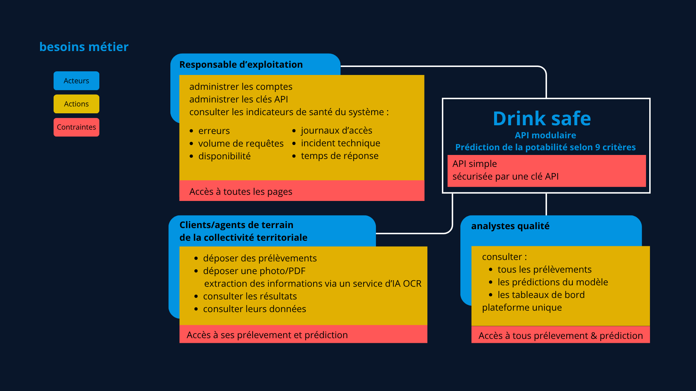
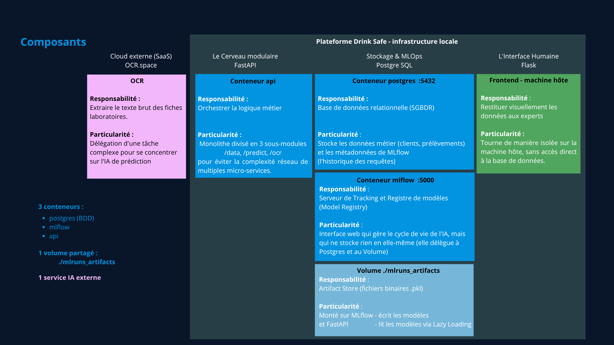
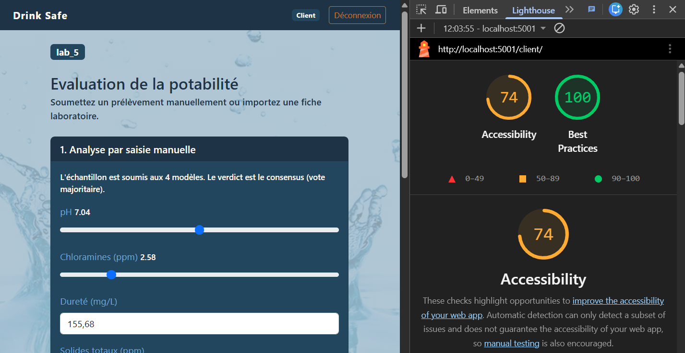
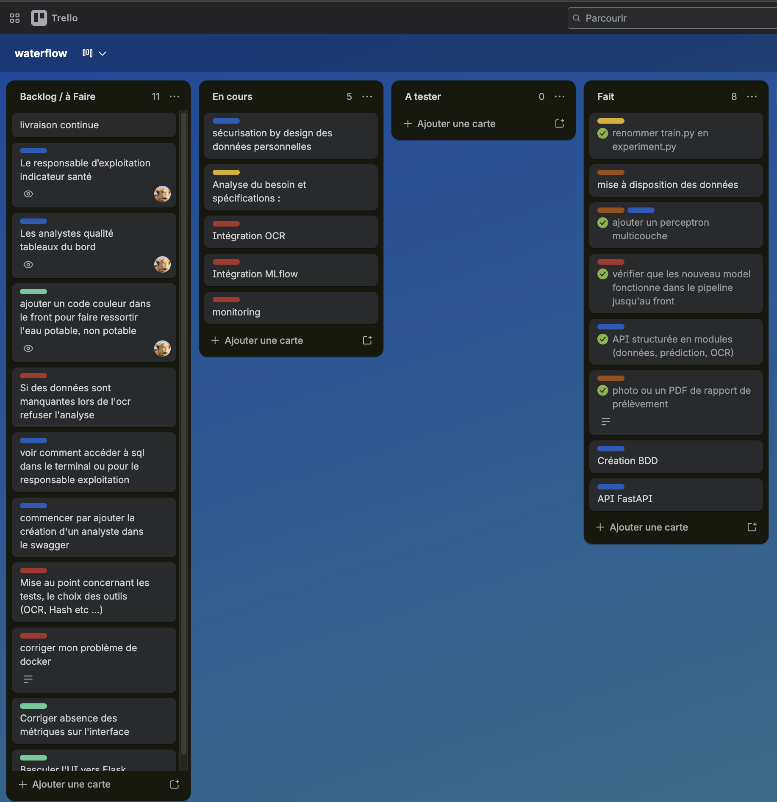
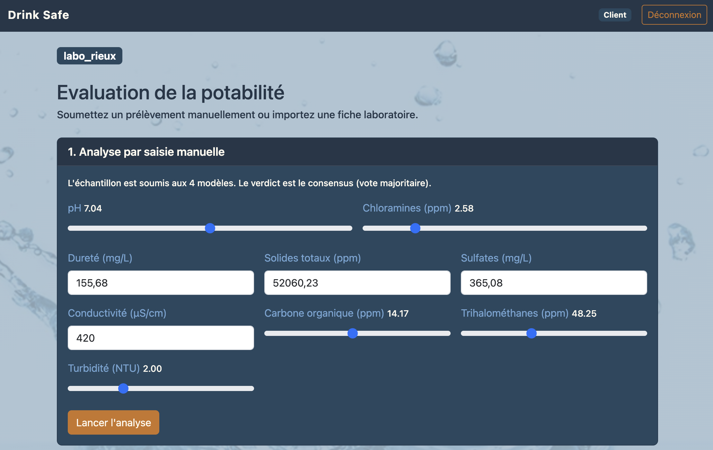
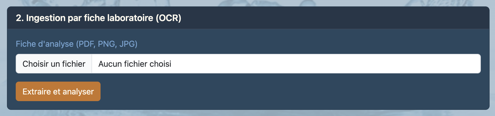

# Evaluation - E 4
## Réaliser une application intégrant un service d’intelligence artificielle

Bloc de compétences 3
référence : REAC page 16-17
Rapport de 15 à 20 pages

---

## Sommaire

- [C14. Analyser le besoin d’application d’un commanditaire intégrant un service d'intelligence artificielle](#c14-analyser-le-besoin-dapplication-dun-commanditaire-intégrant-un-service-dintelligence-artificielle),
en rédigeant les spécifications fonctionnelles et en le modélisant, dans le respect des standards d’utilisabilité et d’accessibilité, afin d’établir avec précision les objectifs de développement correspondant au besoin et à la faisabilité technique.

- [C15. Concevoir le cadre technique d’une application intégrant un service d’intelligence artificielle](#c15-concevoir-le-cadre-technique-dune-application-intégrant-un-service-dintelligence-artificielle),
à partir de l'analyse du besoin, en spécifiant l’architecture technique et applicative et en préconisant les outils et méthodes de développement, pour permettre le développement du projet.

- [C16. Coordonner la réalisation technique d’une application d’intelligence artificielle](#c16-coordonner-la-réalisation-technique-dune-application-dintelligence-artificielle)
en s’intégrant dans une conduite agile de projet et un contexte MLOps et en facilitant les temps de collaboration dans le but d’atteindre les objectifs de production et de qualité.

- [C17. Développer les composants techniques et les interfaces d’une application](#c17-développer-les-composants-techniques-et-les-interfaces-dune-application)
en utilisant les outils et langages de programmation adaptés et en respectant les spécifications fonctionnelles et techniques, les standards et normes d’accessibilité, de sécurité et de gestion des données en vigueur dans le but de répondre aux besoins fonctionnels identifiés.

- [C18. Automatiser les phases de tests du code source lors du versionnement des sources](#c18-automatiser-les-phases-de-tests-du-code-source-lors-du-versionnement-des-sources)
à l’aide d’un outil d’intégration continue de manière à garantir la qualité technique des réalisations.

- [C19. Créer un processus de livraison continue d’une application](#c19-créer-un-processus-de-livraison-continue-dune-application)
en s’appuyant sur une chaîne d’intégration continue et en paramétrant les outils d’automatisation et les environnements de test afin de permettre une restitution optimale de l’application.

---
---
---

## C14. Analyser le besoin d’application d’un commanditaire intégrant un service d'intelligence artificielle
<blockquote>En rédigeant les spécifications fonctionnelles et en le modélisant, dans le respect des standards d’utilisabilité et d’accessibilité, afin
d’établir avec précision les objectifs de développement correspondant au besoin et à la faisabilité technique.</blockquote>

---

### User Stories et Profils

Plateforme [Drink safe](https://github.com/bruno-coulet/drink_safe)

**Phase 1 :** Traduction du cahier des charges fonctionnel fournis par la collectivité territoriale en **spécifications claires**, selon une approche Agile.
Les exigences ont été décomposées pour constituer le Product Backlog.
J'ai défini 3 profils distincts d'utilisateurs pour rédiger nos User Stories
(format : En tant que... Je veux... Afin de...)
associées à des critères d'acceptation précis

1. **Client / Agent de terrain :**
Doit pouvoir déposer ses données (via JSON structuré ou via photo/OCR de fiche labo) et obtenir un verdict de potabilité.
2. **Analyste Qualité :**
Doit superviser la cohérence globale des prélèvements et traquer la dérive (drift) de l'IA via MLflow.
3. **Responsable d'exploitation :**
Exige un maintien en condition opérationnelle (MCO) de l'infrastructure et la gestion sécurisée des Clés API.

### Accessibilité

Conformité et accessibilité numérique

Dans le cadre du respect des standards d’utilisabilité et d’accessibilité, l'interface utilisateur a fait l'objet d'un travail spécifique d'application des directives du [RGAA](https://accessibilite.numerique.gouv.fr/methode/criteres-et-tests/) :

Lisibilité et contraste : Ajustement des tailles de police et vérification des ratios de contraste colorimétrique entre le texte, les boutons et les arrière-plans pour éviter toute fatigue visuelle ou difficulté de lecture.

Navigation et affordance : Optimisation de la clarté visuelle des menus et des éléments d'action (boutons, liens interactifs).

Structure sémantique : Respect strict de la hiérarchie de titrage afin de structurer logiquement l'information et d'assurer une compatibilité optimale avec les outils d'assistance (lecteurs d'écran, navigation au clavier).

#### Audit lighthouse
- Le travail sur les contrastes **doit encore être approfondi**
- Il manque des étiquettes au formulaire **il faut les ajouter**
- La hierachie sémantique peut encore être améliorée pour faciliter la navigation au clavier

Note : Pour plus de détail sur la méthodologie de conception, de l'analyse des User Stories jusqu'au choix de l'architecture et de la priorisation des Sprints, veuillez vous référer à l'Annexe : [cadrage_agile_architecture.pdf](annexes/cadrage_agile_architecture.pdf)

---
---

## C15. Concevoir le cadre technique d’une application intégrant un service d’intelligence artificielle
<blockquote>à partir de l'analyse
du besoin, en spécifiant l’architecture technique et applicative et en préconisant les outils et méthodes de
développement, pour permettre le développement du projet.</blockquote>

---

Afin de soutenir le **découpage Agile du projet** et de permettre la **livraison continue** d'incréments fonctionnels (Sprints), l'architecture applicative a été conçue de manière modulaire.

Plutôt que d'opter pour une architecture micro-services qui aurait ajouté une complexité réseau non justifiée pour la taille du projet, j'ai conçu une architecture basée sur une **API Unique Modulaire** .

### Architecture et Diagramme de Flux
Le système se décompose en conteneurs Docker respectant le principe de responsabilité unique  :
* **Le Cerveau (api) :** Un backend FastAPI orchestrant les routes `/data`, `/predict`, et `/ocr`.
* **Le Stockage (postgres & mlruns_artifacts) :** Une isolation stricte entre la donnée relationnelle (métadonnées) stockée dans PostgreSQL, et les artefacts binaires lourds de l'IA stockés dans un volume monté.
* **L'Interface Experte (Flask) :** Déployée sur la machine hôte pour la restitution visuelle (Dashboard).

#### Eviter de faire travailler le serveur, la base de données ou le modèle d'IA inutilement
Le choix d'une architecture modulaire conteneurisée plutôt que des micro-services lourds, et l'optimisation des requêtes, participent à réduire l'empreinte carbone du projet (Green IT)
Le lazy loading ainsi que le filtrage des features gardes fous avant avant l'appel du model participent aussi de cette recehrche permanent d'économie de transfert de données à chaque fois que possible :

**1. requêtes SQL filtrées**
[C17](#c17-développer-les-composants-techniques-et-les-interfaces-dune-application)
En imposant strictement la clause
`WHERE client_id = :id`
 pour la sécurité, on optimisez aussi la base de données.
 Le serveur ne charge en mémoire et ne transfère sur le réseau que les prélèvements stricts de l'utilisateur, ce qui réduit considérablement la bande passante par rapport à un filtrage qui serait fait côté Python.

**2. Filtrage métier avant le modèle (Garde-fous)**
Le système est conçu pour rejeter instantanément un échantillon si les mesures ne satisfont pas les critères défini par l'OMS (par exemple si le pH ou la turbidité sont aberrants)
Cette optimisation technique économise le temps de calcul (CPU) d'une prédiction Inférence Machine Learning lourde et le stockage d'une requête inutile.

**3. Lazy Loading**
[C11](E3.md/#c11-monitorer-un-modèle-dintelligence-artificielle)
Le modèle (lourd en mémoireRAM) n'est chargé qu'au moment où une requête en a réellement besoin, cela économise les ressources du serveur au démarrage.

Note : Pour plus de détail sur la méthodologie de conception, de l'analyse des User Stories jusqu'au choix de l'architecture et de la priorisation des Sprints, veuillez vous référer à l'Annexe : [cadrage_agile_architecture.pdf](annexes/cadrage_agile_architecture.pdf)

---

## C16. Coordonner la réalisation technique d’une application d’intelligence artificielle
<blockquote>en s’intégrant dans une conduite
agile de projet et un contexte MLOps et en facilitant les temps de collaboration dans le but d’atteindre les objectifs de
production et de qualité.</blockquote>

---

La production technique a été pilotée selon les standards Agile en priorisant les composants selon leur niveau de risque.

La production technique a été pilotée selon une méthodologie hybride **Scrum / Kanban**, en priorisant les composants selon leur niveau de risque (approche MVP First).

### Outils de pilotage et transparence :

- Mise en place d'un tableau Kanban (via Trello) pour la gestion visuelle du flux de travail, colonnes :
    - (Backlog)
    - A faire  (To Do)
    - En cours (In Progress)
    - A tester (Code Review)
    - Fait (Done).

- Mise en commun des documents de réflexion et de planification sur google drive

- Gestion du **Backlog** et décomposition des **User Stories** en tâches techniques chiffrées (**Capabilities**)

- Mise en commun du code sur la forge logicielle [github](https://github.com/bruno-coulet/drink_safe) pour faciliter l'intégration continue.

- Découpage préalable du travail à réaliser en 6 étapes :
    1. Analyse des besoins métier
    2. Traduction des **user stories** en **capabilities**
    3. Découpage en composants
    4. Definition de l'architecture voulue
    5. Choix de la stack technique
    6. Réalisatin du schéma d'architecture et décomposition en backlog

*kanban - Trello*

### Rituels Agiles et facilitation (réunions d'équipe régulière) :
- **Sprint Planning**
Découpage itératif des livrables (définition de l'architecture, intégration MLflow, puis IHM).

- **Daily Stand-ups (Synchronisation)**
Réunions d'équipe régulières pour partager l'état d'avancement, identifier les points de blocage (ex: problèmes de l'API externe OCR) et adapter le sprint en conséquence

- **Sprint Review**
Validation des incréments techniques produits à la fin de chaque itération.

### Priorisation du Backlog et Chemin Critique
Pour livrer la plateforme, j'ai suivi la méthodologie suivante : *MVP First -> Chemin Critique -> Dérisquer tôt* .
1. **Le Modèle de données :** Conception initiale des tables PostgreSQL (`clients`, `prelevements`, `action_logs`) car l'API en dépend totalement.
2. **Intégration IA :** Encapsulation des modèles Waterflow 1 dans FastAPI.
3. **Dérisquage OCR :** Le service OCR.space étant une API externe inconnue, son intégration a été traitée en priorité pour éviter les blocages de fin de projet.

Note : Pour plus de détail sur la méthodologie de conception, de l'analyse des User Stories jusqu'au choix de l'architecture et de la priorisation des Sprints, veuillez vous référer à l'Annexe : [cadrage_agile_architecture.pdf](annexes/cadrage_agile_architecture.pdf)

---
---
---

## C17. Développer les composants techniques et les interfaces d’une application
<blockquote>en utilisant les outils et langages de programmation adaptés et en respectant les spécifications fonctionnelles et techniques, les standards et normes
d’accessibilité, de sécurité et de gestion des données en vigueur dans le but de répondre aux besoins fonctionnels
identifiés.</blockquote>

---

Le développement s'est focalisé sur la sécurité et le respect strict du **RGPD** par **Privacy by Design**

### Besoins fonctionnels identifiés
#### Cloisonnement RGPD (Multi-Tenancy)
Lorsqu'un client de la collectivité s'authentifie, l'API FastAPI :
- intercepte sa `X-API-Key` dans le middleware
- identifie l'UUID du client
- applique un filtre strict en base de données.

La clause SQL `WHERE client_id = :id` garantit qu'un client ne verra jamais les prélèvements d'une autre structure.

#### Développement des Interfaces
J'ai conçu les IHM en utilisant Flask et des templates HTML/CSS (Jinja2). Cette interface comprend :
- des formulaires interactifs pour la prédiction dynamique (avec curseurs pour les valeurs de pH, turbidité, etc.)
- le téléchargement documentaire pour l'OCR
- des tableaux de bord de supervision de données pour les analystes.

*Frontend Flask - interface agent de terrain avec curseurs pour mesures manuelles*

*Frontend Flask - interface agent de terrain formulaire d'ingestion OCR*

*Frontend Flask - interface agent de terrain formulaire d'ingestion OCR*

### Standards de sécurité
#### Conformité OWASP

L'architecture  de la plateforme (API, bases de données, gestion réseau) répond à plusieurs failles majeures du Top 10 OWASP des APIs :

**1. Failles d'authentification et de contrôle d'accès (Broken Authentication & BOLA)**
*   **Protection des secrets :** Le système ne stocke jamais les clés API en clair. Elles sont générées de manière cryptographiquement forte (par exemple via `secrets.token_urlsafe(32)`) puis **hachées en base de données** avec un sel (via SHA-256 ou bcrypt). En cas de compromission (fuite) de la base de données PostgreSQL, les jetons des clients restent illisibles et protégés.
*   **Isolation des données (Multi-Tenancy) :** Au lieu de faire confiance au client, l'API impose une séparation stricte des périmètres directement dans les requêtes SQL (avec la clause `WHERE client_id = :id_client_authentifie`). Cela empêche un attaquant de manipuler les identifiants pour lire les prélèvements d'un autre client (faille appelée *Broken Object Level Authorization* ou BOLA).

**2. Manque de journalisation et de supervision (Insufficient Logging & Monitoring)**
*   La plateforme répond parfaitement à cette faille en implémentant un *Audit Trail* via la table `action_logs` qui trace chaque appel à l'API (adresse IP anonymisée, route HTTP, code statut et temps de réponse).
*   De plus, lere middleware de journalisation **anonymise la clé API** avant de l'écrire en base de données. cela évite d'introduire une vulnérabilité où les logs exposeraient les mots de passe ou les clés en clair.
*   L'intégration de Prometheus et Grafana vient couronner cette recommandation en permettant la détection en temps réel des attaques ou des pannes via les métriques RED (Rate, Errors, Duration).

**3. Vulnérabilités réseau internes (Security Misconfiguration / SSRF)**
*   Le problème réseau concernant le **DNS Rebinding** (l'erreur 403 de MLflow) est typiquement lié aux configurations de sécurité internes.
*   Les serveurs modernes bloquent les requêtes internes dont l'en-tête virtuel (`Host`) est suspect pour éviter qu'un pirate ne rebondisse sur le réseau interne privé. La solution implémentée (le patch de la bibliothèque `requests` pour injecter le bon en-tête `Host` vers `mlflow:5000`) permet aux conteneurs de communiquer en toute légitimité, sans avoir eu besoin de désactiver les barrières de sécurité natives du serveur MLflow.

**4. Interfaçage avec des services tiers (OCR.space)**
*   Un système sécurisé doit aussi rester disponible lorsque le service externe est attaqué ou tombe en panne.
Le mécanisme de **"fallback gracieux"** (interception des *Timeouts* de l'API `api.ocr.space`) empêche un ralentissement externe de faire crasher l'API FastAPI ou l'interface client Flask.

En résumé, l'approche *Privacy by Design* et *Security by Design* adoptée sur la plateforme Drink safe correspond aux standards de l'OWASP.

### éco-conception (Green IT)

>Recommandations d’[éco-index](https://www.ecoindex.fr/ecoconception/) ou [Green IT](https://www.greenit.fr/)

Un systeme de garde-fou sanitaires basé sur les règles métiers de l'OMS est codé en dur dans l'API.
Il permet de bloquer une requête avant de solliciter le modèle

Par exemple,  si un prélèvement présente un pH < 6.5 ou une turbidité > 5.0 NTU, l'API rejette l'échantillon immédiatement

Ce procédé *éco-conception* permet de s'abstenir de faire des inférences inutiles
En évitant de solliciter inutilement un modèle de Machine Learning lourd pour une eau manifestement non conforme, on **économise du temps de calcul (cycles CPU/GPU) et, par conséquent, de l'énergie**

---
---
---

## C18. Automatiser les phases de tests du code source lors du versionnement des sources
<blockquote>à l’aide d’un outil d’intégration continue de manière à garantir la qualité technique des réalisations.</blockquote>

Comme détaillé dans la compétence [C12](E3.md#c12-programmer-les-tests-automatises-dun-modele-dintelligence-artificielle), la validation du code est totalement automatisée.

### Outil d'Intégration Continue
Les suites de tests unitaires, fonctionnels et de MLOps (`pytest`) ont été versionnées sous Git. Elles s'exécutent automatiquement via le moteur d'intégration continue **GitHub Actions**.

Ce processus valide non seulement la syntaxe Python, mais également l'intégrité des requêtes SQL de la base PostgreSQL instanciée temporairement par le pipeline de test.

Cette documentation technique a été rédigée et communiquée dans un format respectant les recommandations d'accessibilité numérique
- hiérarchisation des titres
- contrastes visuels clairs

conformément aux recommandations du [RGAA](https://accessibilite.numerique.gouv.fr/) et de l'association [Valentin Haüy](https://www.avh.asso.fr/nos-solutions/accessibilite/accessibilite-numerique)

### Configuration et Déclencheurs (Triggers)
Conformément aux attentes de l'intégration continue, la configuration de l'automatisation repose sur le fichier ci.yml, versionné directement dans le dépôt Git avec le code source
. Les déclencheurs de ce pipeline ont été paramétrés pour s'exécuter de manière autonome à chaque modification du code. Ainsi, tout Push sur le dépôt ou toute création de Pull Request déclenche immédiatement l'environnement d'intégration
.

### Étapes Automatisées par le Workflow
Le pipeline GitHub Actions exécute séquentiellement les étapes nécessaires à la validation du code
 :
1. Initialisation de l'environnement : Installation automatique de Python et des dépendances du projet via le gestionnaire de paquets ultra-rapide uv

2. Configuration des services : Chargement des variables d'environnement requises et préparation de l'infrastructure de test (connexion à la base de données isolée)

3. Lancement de la suite de tests (pytest) :
    - Tests Unitaires :
    Vérification isolée des règles métiers (ex: garde-fous de l'OMS) et de la sécurisation (rejet des requêtes sans clé API)

    - Tests Fonctionnels :
    Validation du fonctionnement de bout en bout de l'API FastAPI, de la connexion à la base de données, et de l'ingestion OCR

    - Tests MLOps (Non-régression) :
    Chargement dynamique du modèle depuis MLflow et validation que le modèle maintient bien un F1-Score supérieur au seuil d'acceptabilité (60%)
.
### Documentation et Validation de la Qualité
La chaîne d'intégration continue agit comme une barrière de qualité stricte :
le code n'est considéré comme "livrable" que si toutes ces étapes et tous les tests passent avec succès.
Ce dispositif prévient ainsi l'apparition de bugs ou de régressions du modèle en production.

L'ensemble des configurations de cette chaîne, de ses déclencheurs et des outils utilisés (`GitHub Actions`, `pytest`, `uv`) fait l'objet d'une documentation technique claire pour permettre aux autres développeurs du projet d'utiliser, de tester et de maintenir ce pipeline d'intégration

---
---
---

## C19. Créer un processus de livraison continue d’une application
<blockquote>en s’appuyant sur une chaîne d’intégration continue et
en paramétrant les outils d’automatisation et les environnements de test afin de permettre une restitution optimale de
l’application.</blockquote>.

### Validation automatisée par GitHub Actions (CI)
Ce processus de livraison s'appuie directement sur la chaîne d'intégration continue détaillée en C18. À chaque *Push* sur le code source ou création de *Pull Request*, un workflow **GitHub Actions** (`ci.yml`) se déclenche automatiquement de manière autonome. Ce pipeline configure l'environnement de test et lance l'intégralité de la suite logicielle `pytest` (tests unitaires, fonctionnels et vérification du modèle IA).
L'étape de livraison est strictement conditionnée par ce pipeline : le code n'est autorisé à être fusionné (*Merge* de la *Pull Request*) et packagé que si tous les tests automatisés réussissent. Cette barrière de sécurité garantit que les nouvelles modifications ne "casseront" pas l'application en production.

### Conteneurisation et Environnement de restitution (CD)
Une fois le code validé, l'ensemble des briques logicielles (API, MLflow, Pipeline d'entraînement, PostgreSQL) est "packagé" via des `Dockerfile` optimisés et orchestré par un fichier `docker-compose.yml` central.
La configuration inclut les variables d'environnement sécurisées via un fichier `.env`. Ces variables garantissent que la base de données, l'API et les URL de tracking MLOps s'interconnectent automatiquement au lancement.

### Reproductibilité et Accessibilité
Les fichiers de configuration de cette livraison continue sont versionnés depuis le dépôt Git du projet, ce qui sécurise chaque déploiement. Cette approche **Infrastructure as Code** permet au système d'être intégralement reproductible, résilient et prêt pour un passage à l'échelle industriel. Le processus de livraison complet s'exécute avec la simple commande `docker compose up -d`, qui démarre l'infrastructure complète de manière isolée et persistante.

La procédure de lancement, incluant la configuration de l'authentification et l'amorçage de la base de données, fait l'objet d'une documentation technique. Afin de permettre une prise en main optimale par tout responsable d'exploitation, cette documentation est communiquée dans un format qui respecte les recommandations d’accessibilité (par exemple celles du [RGAA](https://accessibilite.numerique.gouv.fr/) et de l’association [Valentin Haüy](https://www.avh.asso.fr/nos-solutions/accessibilite/accessibilite-numerique)).
